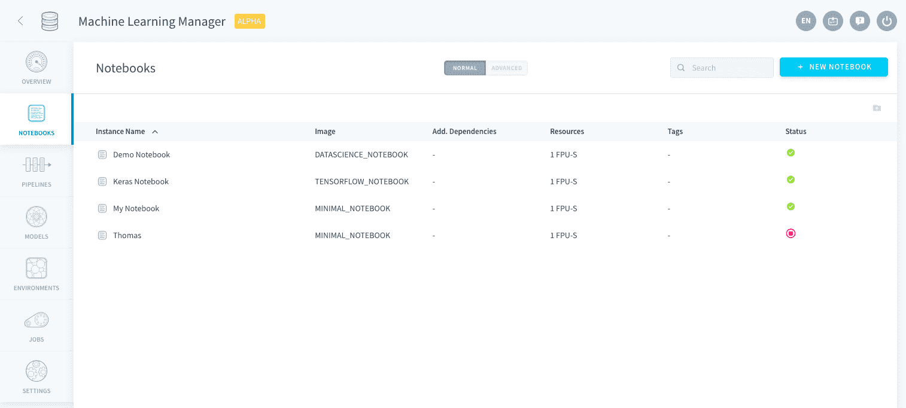
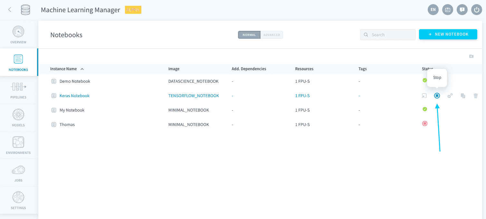
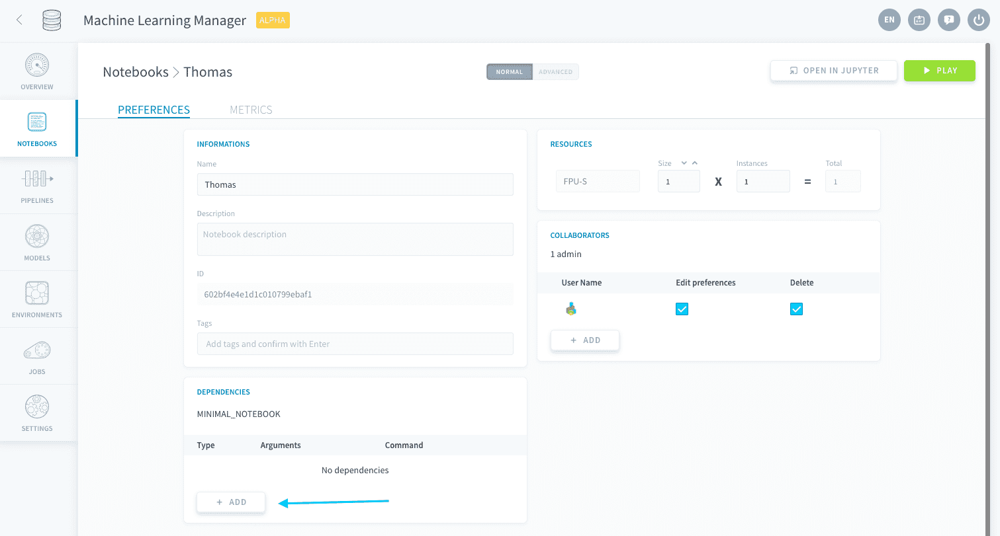

# Notebooks

Notebooksは、[Jupyter Notebook](https://jupyter.org/)をForePaaSに組み込んだものです。データサイエンス用のパッケージが組み込まれているため、Notebooksを利用すると非リアルタイムでインタラクティブな統計分析やデータ表示を行うことができます。Notebooksはデータプラントと高度に連携されているため、Data Managerに保存されたデータを読み込んだり、SDKを利用してNotebooksのコードを[Data Processing Engineのアクション](/jp/product/dpe/actions/index)や[Machine Learning Managerのパイプライン](/jp/product/ml/pipelines/index)に変換したりすることができます。

* [Notebooksの作成と削除](/jp/product/ml/notebooks/index.md?id=create-and-delete-notebooks)
* [Notebooksを開く](/jp/product/ml/notebooks/index.md?id=open-a-notebook)
* [Notebooksの設定の編集](/jp/product/ml/notebooks/index.md?id=edit-the-settings-of-a-notebook)

---
## Notebooksの作成と削除

**Notebooksインスタンス**は、Machine Learning Managerの「Notebooks（ノートブック）」タブで管理できます。Notebooksインスタンスは、特定のリソースと依存関係を含むJupyter環境です。  

Notebooksインスタンスには、複数のNotebooksドキュメント（*.ipynb*ファイル）を含めることができます。これらは、JupyterLabインターフェースで直接管理できます。

Notebookのホームページでは、すべてのNotebooksの**設定の作成、操作、削除、編集**を行うことができます。

?> ForePaaSプラットフォームでは、Notebookインスタンスを表すのに*notebook*という表記を使用します。

{Notebooksの作成方法を確認する}(#/jp/product/ml/notebooks/create.md)

Notebooksを削除するには、🗑️アイコンをクリックします。削除したNotebooksを元に戻すことはできません。

---
## Notebooksを開く

Notebooksを開くと、Notebooksインスタンスが**自動的にオン**になります。別の方法として、Notebooksの「*Play（再生）*」ボタンを押して、関連するサーバーを手動でオンにすることもできます。Notebooksがアクティブになっている間、Notebooksは[割り当てられたすべてのFPU](/jp/product/billing/resources/index)を消費します。 

Notebooksがアクティブになっているときに「*Stop（停止）*」ボタンを押すと、ノートブックを手動でオフにすることができます。

Notebooksを開くには、Notebooksをダブルクリックするか、以下に示すボタンを押します。これにより、新しいJupyterLabウィンドウにNotebooksが開きます。

[JupyterLab](https://jupyterlab.readthedocs.io/jp/stable/)インターフェースでは、複数の*.ipynb*ファイルを同時に開く、キーボードショートカット、ダウンロードやエクスポートのオプションなど、Jupyterが提供しているすべての機能を利用してNotebooksを操作することができます。

---
## Notebooksの設定の編集

Notebooksの設定を編集するには、**歯車**アイコンをクリックします。

以下のオプションの編集を行うことができます。
* [依存関係の編集](/jp/product/ml/notebooks/index.md?id=edit-dependencies)
* [リソースの編集](/jp/product/ml/notebooks/index.md?id=edit-resources)

### 依存関係の編集
Notebooks環境のパッケージと依存関係を編集することができます。変更を適用するには、Notebooksを再起動する必要があります。

すべてのNotebooksの[インスタンスイメージ](/jp/product/ml/notebooks/create)には、デフォルトパッケージが含まれています。依存関係を追加で指定するには、「*Dependencies（依存関係）*」パネルの「**Add（追加）**」ボタンをクリックします。

依存関係のタイプを選択し、サーバーにインストールするパッケージの名前を入力して、Enterキーを押します。

タグのように複数のパッケージをまとめて追加するには、その都度*Enter*キーを押します。

### リソースの編集

ここでは、ノートブックで使用する[リソース](/jp/product/billing/resources/index)を編集できます。変更を適用するには、Notebooksを再起動する必要があります。

---
##  サポートが必要な場合🆘

> お探しの情報は見つかりましたか。サポートが必要な場合は、プラットフォームの「*Support（サポート）*」ページから直接依頼を送信することができます。また、support@forepaas.com宛にメールを送付することもできます。

{サポートに質問を送付する🤔}(https://support.forepaas.com/hc/en-us/requests)