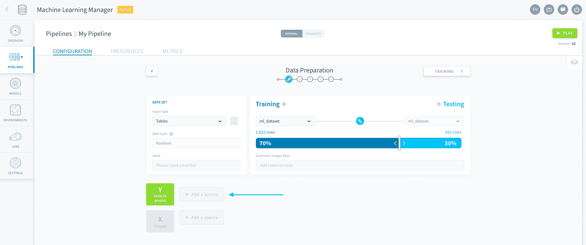
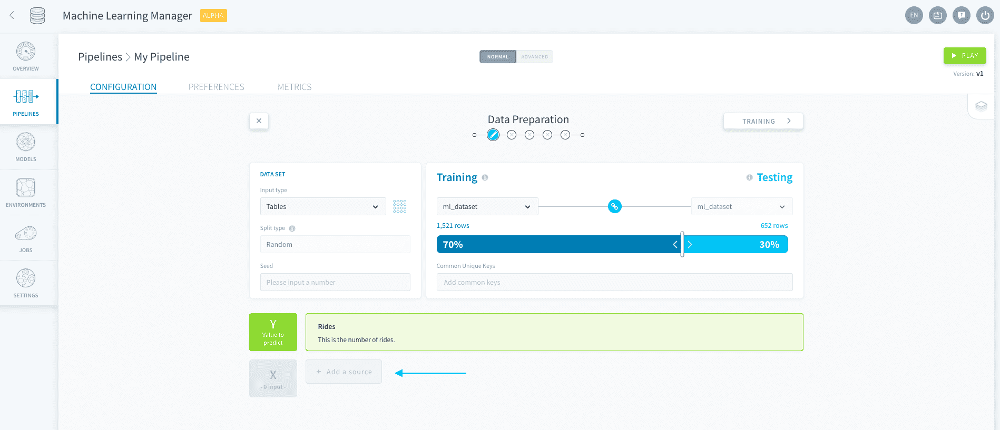

# 特徴量エンジニアリング

ForePaaSでは、モデル用に選択する変数を詳細に指定できます。

---
## 予測対象の値の追加

予測する値（ラベル）は、*Yデータセット*に保存されます。予測対象の値を追加するには、Yの横にある「**Add a source（ソースを追加）**」をクリックします。

[データセットの生成](jp/product/ml/pipelines/configure/dataset/input.md?id=choose-a-data-input)時に指定した入力タイプに基づいてソースを選択し、保存します。

---
## 特徴量の追加

特徴量（変数）は予測を行うのに使用するもので、*Xデータセット*に保存されます。モデルに特徴量を追加するには、Xの横にある「**Add a source（ソースを追加）**」をクリックします。

[データセットの生成](jp/product/ml/pipelines/configure/dataset/input.md?id=choose-a-data-input)時に指定した入力タイプに基づいてソースから変数を必要な数だけ選択し、保存します。

> ヒント：まとめて*すべての変数を追加*することもできます。この方法を使用すると、予測対象の値として選択した値を**除く**ソースのすべての変数が追加されます。

---
## 前処理

[Data Processing Engine（DPE）](jp/product/dpe/index)でソースに対して高度な特徴量エンジニアリングを実行する必要があります。

---
##  サポートが必要な場合🆘

> お探しの情報は見つかりましたか。サポートが必要な場合は、プラットフォームの「*Support（サポート）*」ページから直接依頼を送信することができます。また、support@forepaas.com宛にメールを送付することもできます。

{サポートに質問を送付する🤔}(https://support.forepaas.com/hc/en-us/requests)