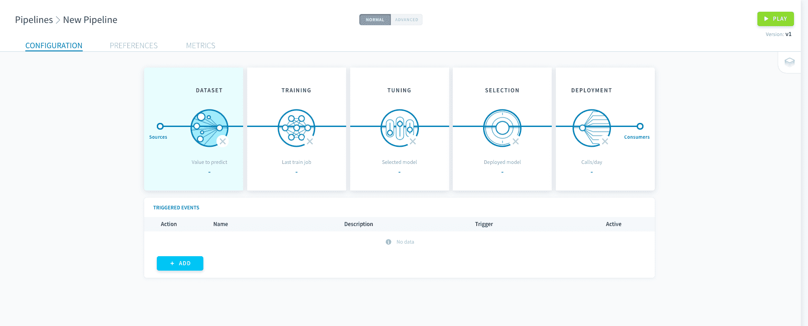

# データの準備

データの準備は、すべての機械学習プロセスの最初のステップです。このステップでは、**データソースを指定し、データをMLデータセットに取り込む際のルールを明示します**。  
MLデータセットは、Data Managerに自動的に作成されるテーブルです。MLデータセットには、パイプラインの入力部分に指定されたソースからデータが供給されます。データの準備では主に、これらのテーブルの行と列の指定を行います。

!> データのバージョン管理を効果的に調整するには、データを特定のMLデータセットにのみ追加します。[パイプラインの基本設定](jp/product/ml/pipelines/execute/preferences.md?id=reset-datasets)には、MLデータセットを手動でリセットするオプションが用意されています。

通常、データの準備はパラメータ設定を行うための最初のステップです。パイプラインの残りの部分はこの設定に基づいて構成されます。データの準備を開始するには、パイプラインのメインページで「**Dataset（データセット）**」をクリックします。

---
## データセットの生成

パイプラインの入力部分には、ForePaaSの内外の複数のソースのデータを接続できます。モデルのフィッティングと評価を行うため、このデータを学習用データセットとテスト用データセットに分割する必要があります。

{ソースおよび学習用／テスト用データセットの分割の管理}(#/jp/product/ml/pipelines/configure/dataset/input.md)

---
## 特徴量エンジニアリング

データの準備を適切に行うには、モデルの特徴量を適切に選択する必要があります。XとYの変数を追加する方法、およびデータの内容に関する基本的なチェックを行う方法を確認してください。

{特徴量の管理}(#/jp/product/ml/pipelines/configure/dataset/features.md)

---
##  サポートが必要な場合🆘

> お探しの情報は見つかりましたか。サポートが必要な場合は、プラットフォームの「*Support（サポート）*」ページから直接依頼を送信することができます。また、support@forepaas.com宛にメールを送付することもできます。

{サポートに質問を送付する🤔}(https://support.forepaas.com/hc/en-us/requests)