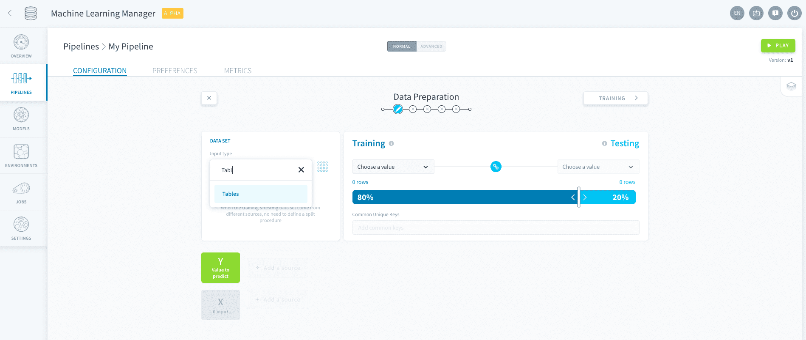
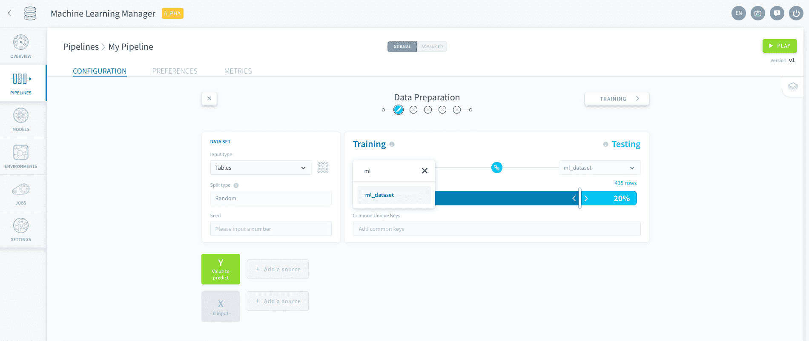
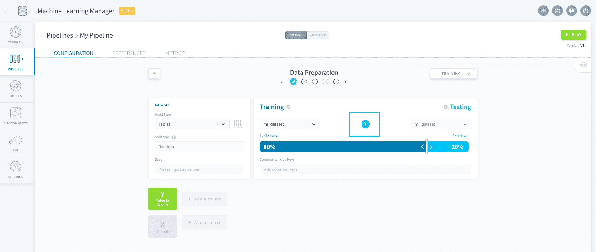
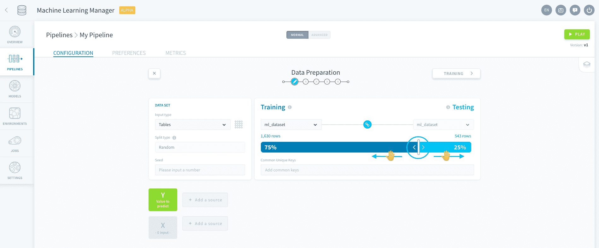
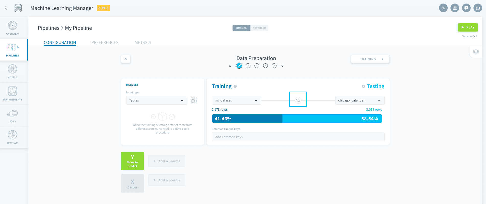
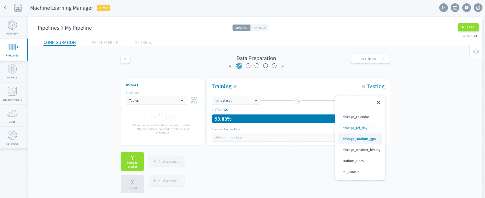

# データセットの生成

データセットの生成では、**データ入力の選択**を行った後に、**データを学習用データセットとテスト用データセットに分割**します。実運用レベルのAIを実行する場合、（手動またはトリガーにより）[データセット生成ジョブ](jp/product/ml/pipelines/execute/index.md?id=dataset-generation-jobs)が新たに起動されるのに合わせて、継続的にこのデータセットの分割が行われます。 

---
## データ入力の選択

ForePaaSでは、次の入力タイプをサポートしています。

* [Data Managerのテーブル](jp/product/ml/pipelines/configure/dataset/input.md?id=tables)
* [バケット](jp/product/ml/pipelines/configure/dataset/input.md?id=buckets)

> 弊社では、MLパイプラインへの連携の強化に取り組んでいます。お客様のプロジェクトに必要な情報が見つからない場合は、弊社の[ロードマップポータル](https://hq.forepaas.io/#/features)を通じてご意見をお寄せください💡。

### Tables（テーブル）

「*Tables（テーブル）*」入力タイプでは、**Data Managerのテーブル**から選択できます。未加工テーブル、Primテーブル、Martテーブルから選択できます。

### バケット

🚧 *準備中!*

---
## 学習／テストの分割

データソースの選択が済んだら、学習用セットとテスト用セットに分割して、機械学習アルゴリズムで使用できるようにする必要があります。

?> **学習用セット**：モデルのフィッティング（学習）に使用するデータのサンプル  
 **テスト用セット**：学習済みモデルの公正な評価を行うのに使用するデータの独立したサンプル学習用セットとテスト用セットは、常に分離した状態を維持する必要があります。
 
ForePaaSでは、学習用データセットとテスト用データセットに[同じソース](jp/product/ml/pipelines/configure/dataset/input.md?id=use-the-same-source)を使用するか、[2つの異なるソース](jp/product/ml/pipelines/configure/dataset/input.md?id=use-different-sources)を使用するかを選択できます。 

### 同じソースの使用

「Training（学習）」で、必要なデータソースを選択します。

次に、学習用セットとテスト用セットで同じソースを使用するため、「Training（学習）」と「Testing（テスト）」の間の**リンク🔗アイコン**をアクティブにします。

続いて、「Training（学習）」と「Testing（テスト）」のデータの分割方法を指定します。スライダーを使用して、学習用セットとテスト用セットのデータポイント数（テーブルの場合は行数、バケットの場合はファイル数など）の割合を選択します。

また、「Data Set（データセット）」パネルで「**Split Type（分割タイプ）**」オプションを使用して、分割を実行するのに使用する方法を制御することもできます。「*Random（ランダム）*」の場合は、指定の分割割合を維持しながら、入力された各データポイントが学習用セットまたはテスト用セットにランダムに割り当てられます。疑似ランダム化の**シード**を指定すると、ランダム性を再現することができます。 

!> データポイントがソースから削除された場合でも、MLデータセット（学習用またはテスト用）からデータポイントを個別に削除することはできません。[パイプラインの基本設定](jp/product/ml/pipelines/execute/preferences.md?id=reset-datasets)には、各自の責任でMLデータセットを手動でリセットするオプションが用意されています。

### 異なるソースの使用

「Training（学習）」で、必要なデータソースを選択します。

学習用セットとテスト用セットで異なるソースを使用するため、「Training（学習）」と「Testing（テスト）」の間の**リンク🔗アイコン**をオフにします。

「Testing（テスト）」で、必要なデータソースを選択します。

> 異なるソースを使用する場合は、すでに分割が行われているため、学習／テストの分割方法を指定する必要はありません。入力された各データポイントは、学習用セットまたはテスト用セットに適切に割り当てられます。

!> データポイントが入力から削除された場合でも、MLデータセット（学習用またはテスト用）からデータポイントを個別に削除することはできません。[パイプラインの基本設定](jp/product/ml/pipelines/execute/preferences.md?id=reset-datasets)には、各自の責任でMLデータセットを手動でリセットするオプションが用意されています。

データセットの行を指定した後に、データセットの列を指定する必要があります。

{モデルの特徴量の選択}(#/jp/product/ml/pipelines/configure/dataset/features.md)

---
##  サポートが必要な場合🆘

> お探しの情報は見つかりましたか。サポートが必要な場合は、プラットフォームの「*Support（サポート）*」ページから直接依頼を送信することができます。また、support@forepaas.com宛にメールを送付することもできます。

{サポートに質問を送付する🤔}(https://support.forepaas.com/hc/en-us/requests)