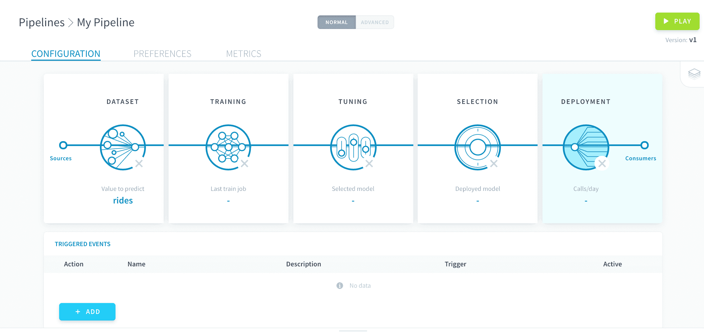

# デプロイの設定

デプロイのセットアップはパイプラインの設定の最後のステップです。ここでは、パイプラインによって生成されるモデルの使用方法を指定します。

すべての設定は、**コンシューマー**と呼ばれるものを介して行われます。コンシューマーは、デプロイ済みモデルにアクセスするためにパイプラインの出力に接続されたエンティティです。コンシューマーには、予測を行うためにデータを供給できます。1つのパイプラインで複数のコンシューマーを使用できるため、デプロイ済みモデルを一度に複数の方法で使用できます。 

コンシューマーにより、デプロイ済みモデルをデータプラントの**外部**と**内部**の両方から呼び出すことができます。

* 外部呼び出しでは、データプラントのいずれかのAPIのエンドポイントを使用します。この場合は認証が必要です。
* 内部呼び出しでは、Data Processing Engine（DPE）を使用して、Data Managerにデータのロードと書き込みを行います。

* [コンシューマーの作成](jp/product/ml/pipelines/configure/deployment/index.md?id=create-a-consumer)
* [コンシューマーを使用した予測](jp/product/ml/pipelines/configure/deployment/index.md?id=use-a-consumer-to-make-predictions)

---
## コンシューマーの作成
新しいコンシューマーを作成するには、「Consumers（コンシューマー）」パネルで「*Add（追加）*」をクリックします。

次に、**入力**と**出力**を選択する必要があります。入力はコンシューマーにデータを渡す方法を表し、出力は予測を返す方法を表します。 

### **入力のオプション**

ForePaaSでは、コンシューマーの入力に対して以下のオプションから選択することができます。

|            入力タイプ            |        説明         | 
| :------------------------------: | -------------------------- | 
|            **APIエンドポイント**      | データポイントを送信するためのエンドポイント  | 
|            **テーブル**             | データポイントを提供するためのData Managerのテーブル | 

#### APIエンドポイントの入力

予測のエンドポイントを作成するには、デプロイ済みの[データプラントのAPI](/jp/product/api-manager/index)が必要です。コンシューマーを作成する際に、使用するデータプラントのAPIを指定します。

その後、作成するエンドポイントの名前を指定します。

!> 別のパイプラインであっても、すでに存在するエンドポイントを使用することはできません。

#### テーブルの入力

コンシューマーを作成する際に、Data Managerのいずれかのテーブルを指定します。

> Data Managerのテーブルの属性は、モデルの特徴量と名前が同じでなくても構いません。[生成されるDPEの予測アクション](/jp/product/ml/pipelines/configure/deployment.md?id=use-a-consumer-to-make-predictions)でマッピングをカスタマイズすることができます。ただし、モデルのすべての特徴量は、入力テーブル内に何らかの形で存在している必要があります。

### **出力のオプション**

ForePaaSでは、コンシューマーの出力に対して以下のオプションから選択することができます。

|            入力タイプ       |        説明         | 
| :-------------------------: | -------------------------- | 
|       **APIエンドポイント**      | 予測を受け取るためのエンドポイント  | 
|       **テーブル**             | 予測が書き込まれるData Managerのテーブル | 

#### APIエンドポイントの出力

このオプションは、入力として*APIエンドポイント*を選択したときに自動的に選択されます。このエンドポイントは入力と同じです。

#### テーブルの出力

このオプションは、入力として*テーブル*を選択したときに自動的に選択されます。同じテーブルまたは別のテーブルを入力として選択できます。

> Data Managerのテーブルの属性は、モデルの予測対象の値と名前が同じでなくても構いません。[生成されるDPEの予測アクション](/jp/product/ml/pipelines/configure/deployment.md?id=use-a-consumer-to-make-predictions)でマッピングをカスタマイズすることができます。

---
## コンシューマーを使用した予測

コンシューマーの作成が済んだら、コンシューマーを使用して予測を行うことができます。 

* コンシューマーの入力または出力として*APIエンドポイント*を使用すると、[呼び出し可能なAPIエンドポイント](jp/product/ml/pipelines/configure/deployment/index.md?id=use-an-api-endpoint)が作成されます。  
* コンシューマーの入力または出力として*テーブル*を使用すると、[実行可能なDPEの予測アクション](jp/product/ml/pipelines/configure/deployment/index.md?id=use-a-dpe-predict-action)が自動的に作成されます。

### APIエンドポイントの使用

**目👁️のアイコン**をクリックして、APIコントロールパネルを開きます。

APIエンドポイントで予測を行うには、最初に[認証トークンを生成](jp/product/iam/users/api-secret-key.md?id=generating-authentication-token)する必要があります。このトークンは、[APIキーとシークレットキー](jp/product/iam/users/api-secret-key)を入力し、APIコントロールパネルで指定されたコマンドを実行することで容易に生成できます。

予測ジョブを起動するには、APIコントロールパネルに用意されたサンプルコマンドを実行します。リクエストに、先ほど生成した**認証トークン**と、**予測を行うためのデータ**の2つのパラメータを入力する必要があります。各データポイントは、モデルの特徴量とそれぞれの値を含むディクショナリで表されます。複数のディクショナリを配列に含めることで、複数のデータポイントを一度に予測できます。

> このコントロールパネルには、変数名と値の入力方法を示すため、テンプレートデータのペイロードがあらかじめ読み込まれています。

### DPEの予測アクションの使用

コンシューマーに関連する予測アクションは、デフォルトで、Data Processing Engineの「Actions（アクション）」メニューの「*Machine Learning（機械学習）*」リポジトリに生成されます。 

{予測アクションの設定および実行方法を確認する}(#/jp/product/dpe/actions/predict/index.md)

---
##  サポートが必要な場合🆘

> お探しの情報は見つかりましたか。サポートが必要な場合は、プラットフォームの「*Support（サポート）*」ページから直接依頼を送信することができます。また、support@forepaas.com宛にメールを送付することもできます。

{サポートに質問を送付する🤔}(https://support.forepaas.com/hc/en-us/requests)