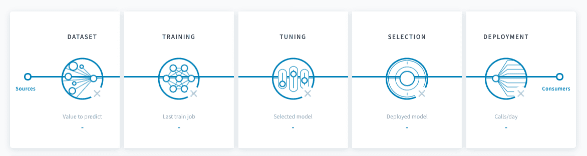

# パイプラインの設定

実運用に対応した正確な予測モデルを作成するには、各パイプラインのデータ入力からデプロイオプションまでを設定します。 

---
## 設定の5つのステップ

ForePaaSでのパイプラインの設定には、5つの主要なステップが存在します。

   
1

   <a class="landing-link" href="#/jp/product/ml/pipelines/configure/dataset/index.md">
      
      

         <h2>データセットの準備</h2>
         
モデルの学習用データセットとテスト用データセットに関する設定を行います。

      

   </a>

   
2

   <a class="landing-link" href="#/jp/product/ml/pipelines/configure/training/index.md">
      
      

         <h2>学習プロシージャ</h2>
         
モデルのベースとなる推定器と、モデルの微調整に必要なスコア評価と検証のオプションを設定します。

      

   </a>

   
3

   <a class="landing-link" href="#/jp/product/ml/pipelines/configure/tuning/index.md">
      
      

         <h2>ハイパーパラメータの調整</h2>
         
直感的な優れた調整機能を利用して推定器のハイパーパラメータを微調整します。

      

   </a>

   
4

   <a class="landing-link" href="#/jp/product/ml/pipelines/configure/validation/index.md">
      
      

         <h2>モデルの選択</h2>
         
パイプラインが作成されてから学習を行ったモデルを比較し、デプロイするモデルを特定します。

      

   </a>

   
5

   <a class="landing-link" href="#/jp/product/ml/pipelines/configure/deployment/index.md">
      
      

         <h2>デプロイの設定</h2>
         
実運用に対応した推論サービスの各種設定を指定します。

      

   </a>

---
## 実行オプションの管理

パイプラインの設定を行った後は、さまざまな実行オプションを管理して、運用環境での信頼性の高いモデルのライフサイクル管理を行うことができます。以下でパイプラインの実行とモデルのライフサイクルの詳細をご確認ください。

{パイプラインの実行の管理}(#/jp/product/ml/pipelines/execute/index.md)

---
##  サポートが必要な場合🆘

> お探しの情報は見つかりましたか。サポートが必要な場合は、プラットフォームの「*Support（サポート）*」ページから直接依頼を送信することができます。また、support@forepaas.com宛にメールを送付することもできます。

{サポートに質問を送付する🤔}(https://support.forepaas.com/hc/en-us/requests)