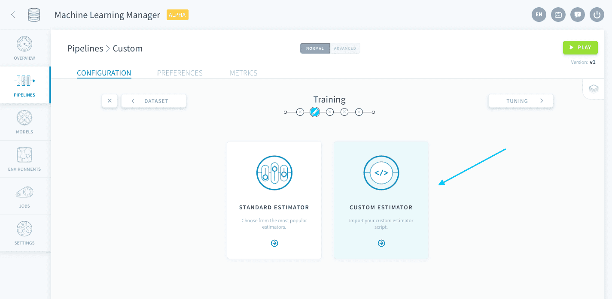
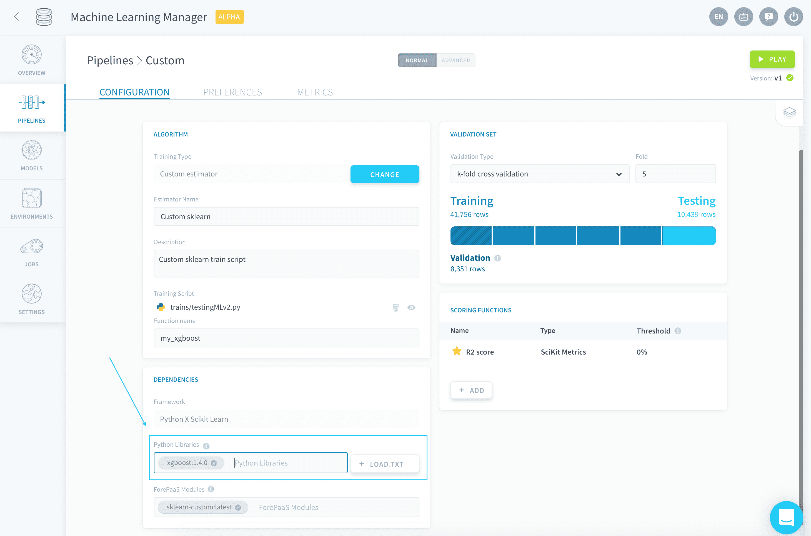
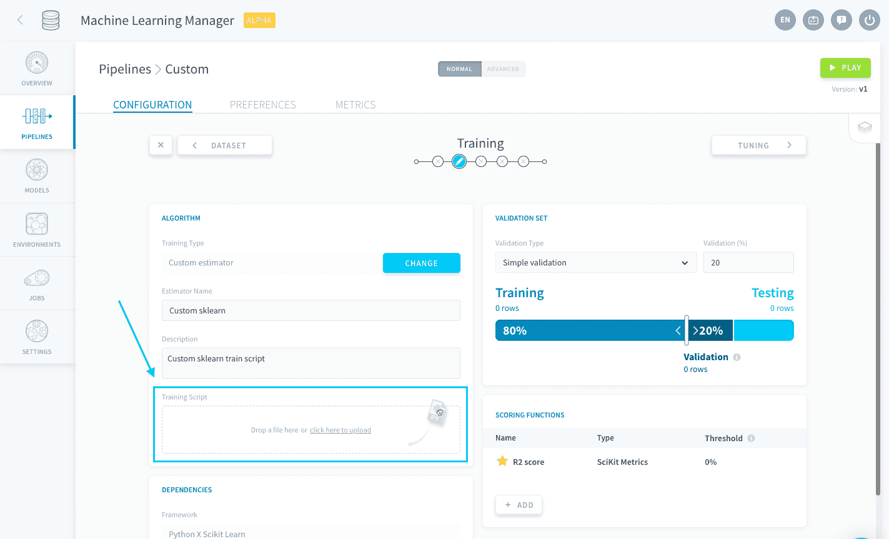
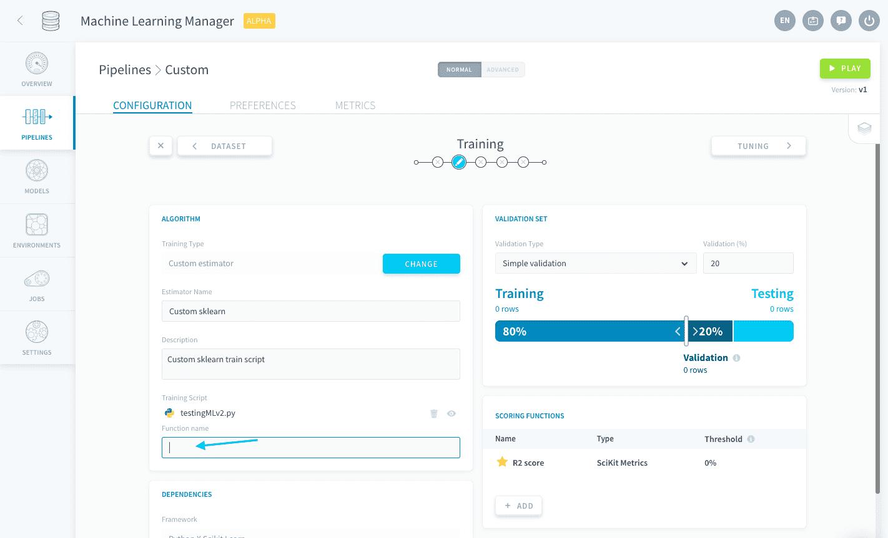
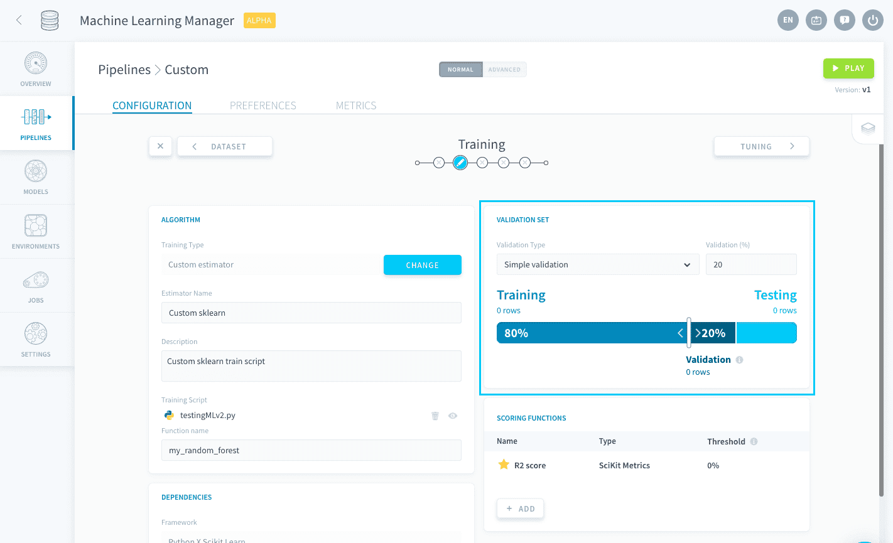
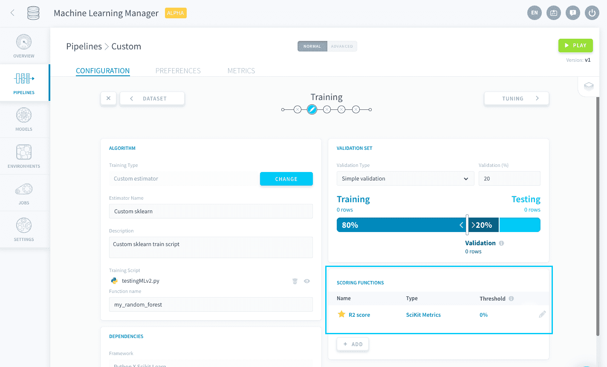
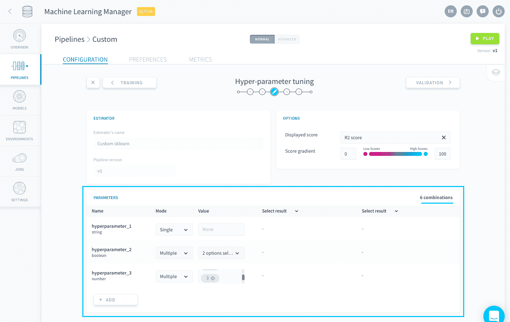

# カスタム推定器

標準推定器の中に必要なものが見つからない場合や、すでに学習用スクリプトをお持ちの場合、ForePaaSでは、独自の推定器をアップロードしてパイプラインのデータでフィッティングを行うことができます。これを行うには、「Training（学習）」の設定ページを開くか（初めて行う場合）、[アルゴリズムの変更](/jp/product/ml/pipelines/configure/training/standard-estimator.md?id=change-your-pipeline39s-estimator)を行います（すでにアルゴリズムが存在する場合）。



パイプラインのフレームワークを選択する必要があります。ForePaaSでは、現在、次のフレームワークがサポートされています。

* [Scikit Learn](/jp/product/ml/pipelines/configure/training/custom-estimator.md?id=scikit-learn-framework)
* Keras*（準備中！）* 

---
## Scikit Learnフレームワーク

このフレームワークでは、**Scikit Learnライブラリと互換性のある**推定器を含むPythonの*.py*ファイルをアップロードできます。サポートされるライブラリには、[Scikit Learn](https://scikit-learn.org/)、[XGBoost](https://xgboost.readthedocs.io/jp/latest/)、[lightgbm](https://lightgbm.readthedocs.io/jp/latest/)などが含まれます。

このフレームワークを選択すると、次のように、パイプラインの環境にいくつかのパッケージがデフォルトでインポートされます。
- scikit-learn
- [ForePaaSのSDKに付属している](https://forepaas-sdk.readthedocs.io/jp/latest/index.html)ライブラリ

カスタムスクリプトで使用されるその他のライブラリは、「[Dependencies（依存関係）](/jp/product/ml/pipelines/configure/training/dependencies)」パネルの「**Python libraries（Pythonライブラリ）**」フィールドで指定する必要があります（最新バージョンを使用しない場合は、バージョンも指定する必要があります）。



> 💡[必要なすべてのライブラリをまとめて追加](/jp/product/ml/pipelines/configure/training/dependencies.md?id=import-a-requirementstxt-file)する場合は、*requirements.txt*ファイルをロードできます。

### カスタム推定器のアップロード
カスタム推定器をアップロードするには、*.py*ファイルを「Training Script（学習用スクリプト）」ボックスにドラッグするか、このボックスをクリックしてファイルエクスプローラーを開きます。



[学習ジョブが起動](/jp/product/ml/pipelines/execute/index.md?id=training-jobs)されると、この*.py*ファイルが実行されるファイルになります。これには、次の2つの要件を備えた関数が含まれている必要があります。
* 最初の引数に`event`が含まれている
* 学習用データセットに基づいてフィッティングされた推定器を返す

この関数名は「*Function name（関数名）*」ボックスに記入します。



以下は、Scikit Learnの基本的なカスタム推定器のサンプルコードです。

```py
from sklearn.ensemble import RandomForestClassifier
from forepaas.ml import get_train_dataset


def my_random_forest(event):
    # Retrieve train dataset.
    x, y = get_train_dataset()

    # Fit estimator.
    clf = RandomForestClassifier(n_estimators=200, max_depth=9)
    clf.fit(x, y)

    # Return fitted estimator.
    return clf
```
> 上記のコードでは、*my_random_forest*を「**Function name（関数名）**」として指定する必要があります。

上記のコードでは、「Training（学習）」および「Tuning（調整）」ステップで行われる設定を使用できませんが、お使いの推定器からパイプラインの設定の他の部分に接続することは可能です。このため、お使いのカスタム推定器で、ForePaaSのパイプラインで提供されるすべての機能を利用することができます。 

次の設定を統合することができます。

* [「Training（学習）」ステップで設定された検証の設定を使用](/jp/product/ml/pipelines/configure/training/custom-estimator.md?id=use-a-validation-configuration)
* [「Training（学習）」ステップで追加された検証スコア関数を使用](/jp/product/ml/pipelines/configure/training/custom-estimator.md?id=use-a-validation-score-function)
* [「Tuning（調整）」ステップで指定したハイパーパラメータを使用](/jp/product/ml/pipelines/configure/training/custom-estimator.md?id=use-hyper-parameters)

!>
「Training（学習）」ジョブではカスタム*.py*スクリプトのみが実行されるため、上記の設定がPythonスクリプトに統合されない場合、インターフェース経由での変更内容がパイプラインに反映されなくなります。


### 検証の設定の使用
「Training（学習）」ステップで設定された[検証の設定](jp/product/ml/pipelines/configure/training/validation)を接続できます。



単純検証を使用する場合に、検証セットに割り当てられた割合を取得するには、次のコマンドを実行します。

```py
from forepaas.core.settings import ML_CONFIG

# Set ratio to the % size of the validation set
ratio = ML_CONFIG["train"]["ratio"]
```

交差検証を使用する場合に、選択された分割数を取得するには、次のコマンドを実行します。

```py
from forepaas.core.settings import ML_CONFIG

# Set cv to either the number of folds, or False if cross-validation is turned off.
cv = ML_CONFIG["train"]["execution_options"]["cross_validation"]
```

サンプルは[下部](/jp/product/ml/pipelines/configure/training/custom-estimator.md?id=sample-code)にあります。

### 検証スコア関数の使用
「Training（学習）」ステップで追加された[スコア評価関数](jp/product/ml/pipelines/configure/training/validation)を接続して、検証スコアにスコア評価関数を使用することができます。



デフォルト⭐のスコア評価関数を取得し、sklearnスコアラーにするには、次のコマンドを実行します。

```py
from forepaas.ml import get_train_scoring_function
from sklearn.metrics import make_scorer

scoring_function = get_train_scoring_function()
```
サンプルは[下部](/jp/product/ml/pipelines/configure/training/custom-estimator.md?id=sample-code)にあります。

### ハイパーパラメータの使用
「Tuning（調整）」ステップで指定された[ハイパーパラメータリスト](jp/product/ml/pipelines/configure/tuning/index)を接続することができます。



ハイパーパラメータとそれぞれの値のディクショナリを取得するには、次のコマンドを実行します。

```py
from forepaas.ml import get_hyper_parameters

hyper_parameters = get_hyper_parameters()
```
サンプルは[下部](/jp/product/ml/pipelines/configure/training/custom-estimator.md?id=sample-code)にあります。

### サンプルコード
この例では、上記の3つすべてのコネクターを組み合わせて使用しています。

```py
from sklearn.ensemble import RandomForestClassifier
from sklearn.model_selection import GridSearchCV
from sklearn.metrics import make_scorer
from forepaas.core.settings import ML_CONFIG
from forepaas.ml import get_train_dataset, get_hyper_parameters, get_train_scoring_function


def my_random_forest(event):
    # Retrieve train dataset. No need to split it since it will be done by cross validation
    x, y = get_train_dataset()

    # Retrieve validation settings.
    cv = ML_CONFIG["train"]["execution_options"]["cross_validation"]
    if not cv:
        cv = get_shuffle_split(x, y)

    # Retrieve scoring function used for the validation score, and make it compatible with scikit's gridSearchCV
    scoring_function = get_train_scoring_function()
    scoring = make_scorer(scoring_function["func"])
 
    # Retrieve hyper parameters.
    hyper_parameters = get_hyper_parameters()

    # Start grid search with cross validation
    clf = RandomForestClassifier()
    grid_search = GridSearchCV(clf, hyper_parameters, scoring=scoring, cv=cv, return_train_score=True)
    grid_search.fit(x, y)
    return grid_search


def get_shuffle_split(x, y):
    from sklearn.model_selection import ShuffleSplit

    ratio = ML_CONFIG["train"]["ratio"]

    rs = ShuffleSplit(n_splits=1, test_size=ratio)
    return rs.split(x)
```

> 上記のコードでは、*my_random_forest*を「**Function name（関数名）**」として指定する必要があります。


---
##  サポートが必要な場合🆘

> お探しの情報は見つかりましたか。サポートが必要な場合は、プラットフォームの「*Support（サポート）*」ページから直接依頼を送信することができます。また、support@forepaas.com宛にメールを送付することもできます。

{サポートに質問を送付する🤔}(https://support.forepaas.com/hc/en-us/requests)