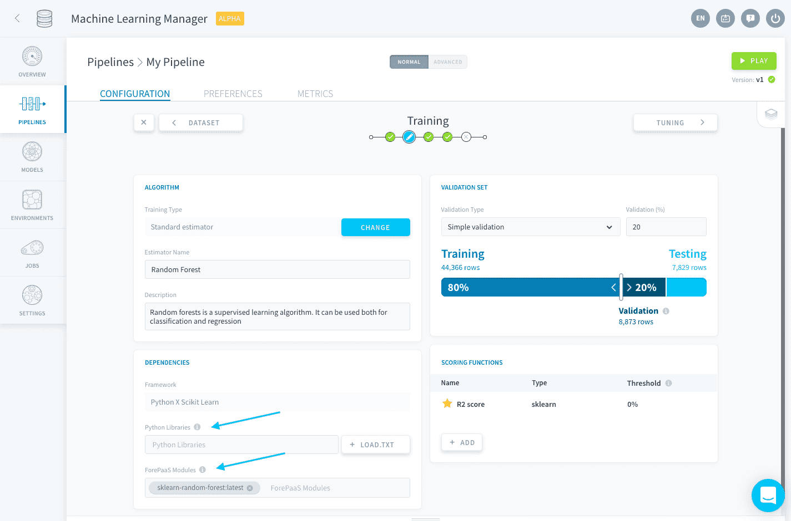
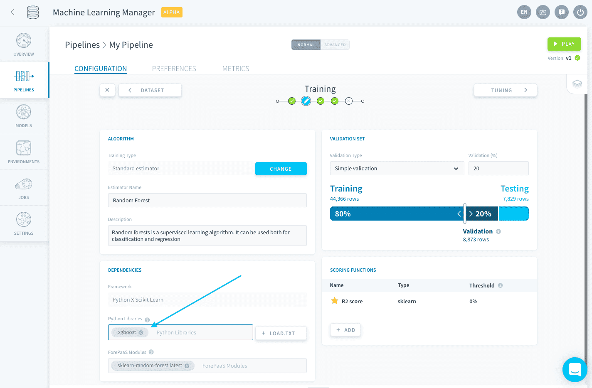
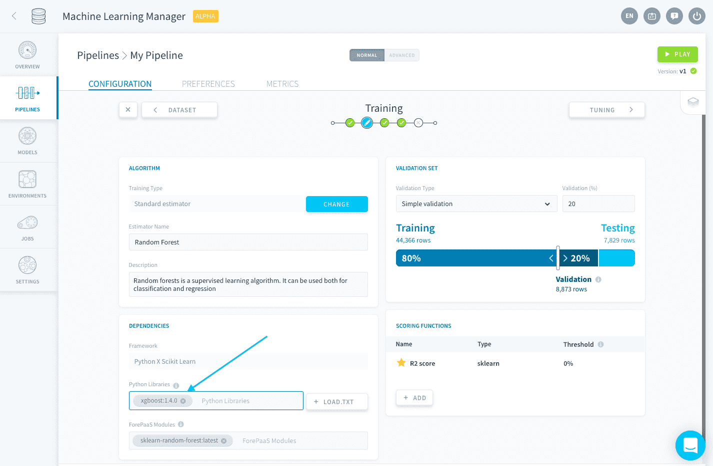
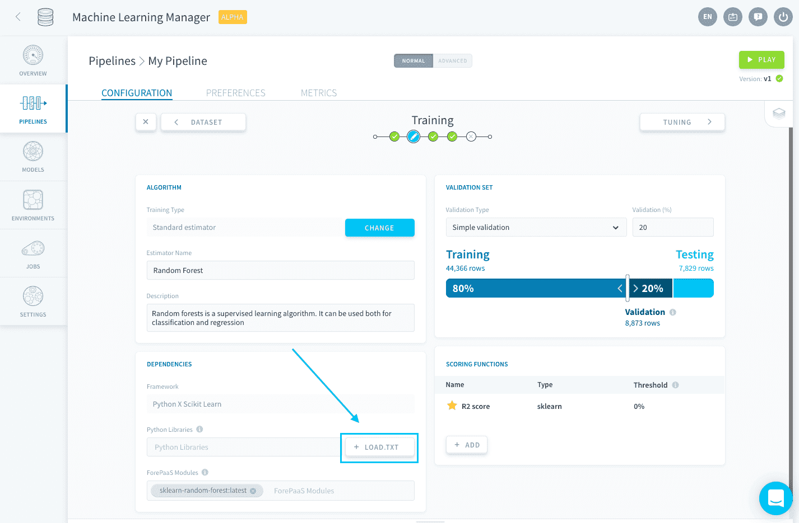

# ライブラリと依存関係の管理

「Dependencies（依存関係）」パネルでは、パイプラインの実行に必要なすべてのパッケージの要件を管理できます。次の2種類の依存関係が存在します。

- **ForePaaSモジュール**：これらはForePaaSが用意したもので、標準推定器を実行するのに必要なすべてのライブラリが含まれます。
- **Pythonライブラリ**：これらはForePaaSモジュールに含まれていない推定器スクリプトで使用されるライブラリです。これらは[カスタム推定器](/jp/product/ml/pipelines/configure/training/custom-estimator.md)を使用する場合にのみ追加する必要があります。



標準推定器を使用する場合は、**選択内容を反映してすべての依存関係が自動的に設定されます**。ライブラリ要件の扱いに苦慮する必要はなく、システムによって自動的に処理されます。

---
## ライブラリのインポート

ライブラリを[1つずつ](/jp/product/ml/pipelines/configure/training/dependencies.md?id=import-a-single-library)指定するか、*requirements.txt*ファイルを使用して[まとめて](/jp/product/ml/pipelines/configure/training/dependencies.md?id=import-a-requirementstxt-file)ライブラリをインポートすることができます。

### 1つのライブラリのインポート

1つのライブラリを指定するには、「**Python Libraries（Pythonライブラリ）**」フィールドにパッケージ名を入力します。



また、*ライブラリ:バージョン*の形でバージョンを指定することもできます。



### requirements.txtファイルのインポート

`pip freeze`[コマンド](https://pip.pypa.io/jp/stable/reference/pip_freeze/)の出力のような書式付きのテキストファイルを使用して、プロジェクトに必要なすべてのライブラリをまとめてインポートできます。 

「*Load.txt（.txtのロード）*」をクリックしてテキストファイルをアップロードします。



requirements.txtの想定される書式を以下に示します。

```txt
docutils==0.11
Jinja2==2.7.2
MarkupSafe==0.19
Pygments==1.6
Sphinx==1.2.2
```

---
##  サポートが必要な場合🆘

> お探しの情報は見つかりましたか。サポートが必要な場合は、プラットフォームの「*Support（サポート）*」ページから直接依頼を送信することができます。また、support@forepaas.com宛にメールを送付することもできます。

{サポートに質問を送付する🤔}(https://support.forepaas.com/hc/en-us/requests)