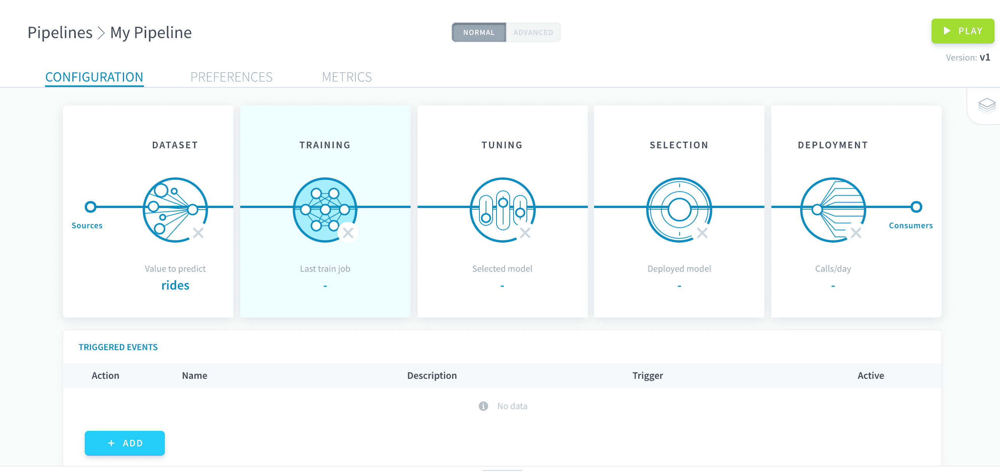

# 学習プロシージャ

学習プロシージャは、すべての機械学習モデルに不可欠な要素です。学習プロシージャでは、ベースとなる数理アルゴリズム（推定器）と、**フィッティングと評価**に使用する一連のルールを定義します。

通常、学習はパイプラインの設定で2番目に行われるステップです。3番目のステップである[ハイパーパラメータの調整](/jp/product/ml/pipelines/configure/tuning/index)を組み合わせて実行することで、パイプラインから比較とデプロイを行う学習済みモデルを生成できるようになります。

---
## 標準推定器を使用した学習

最も一般的として選別されたMLライブラリ一覧にある標準推定器を使用すると、パイプラインの設定を素早く始めることができます。

{標準推定器の使用}(#/jp/product/ml/pipelines/configure/training/standard-estimator.md)

---
## カスタム推定器を使用した学習

ForePaaSストアに必要な推定器が見つからない場合は、独自のカスタム推定器をインポートして、望みどおりに学習プロシージャを実行することができます。

{カスタム推定器の使用}(#/jp/product/ml/pipelines/configure/training/custom-estimator.md)

---
## スコア評価と検証

モデルを公正に評価するためには、学習ステップでスコア評価と検証を行う必要があります。スコア評価と検証を適切に設定する方法をご確認ください。

{スコア評価と検証の設定}(#/jp/product/ml/pipelines/configure/training/validation.md)

---
##  サポートが必要な場合🆘

> お探しの情報は見つかりましたか。サポートが必要な場合は、プラットフォームの「*Support（サポート）*」ページから直接依頼を送信することができます。また、support@forepaas.com宛にメールを送付することもできます。

{サポートに質問を送付する🤔}(https://support.forepaas.com/hc/en-us/requests)