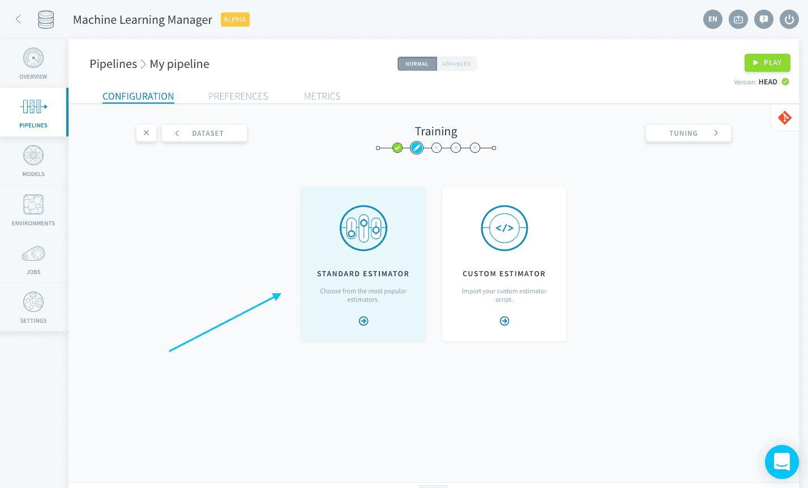
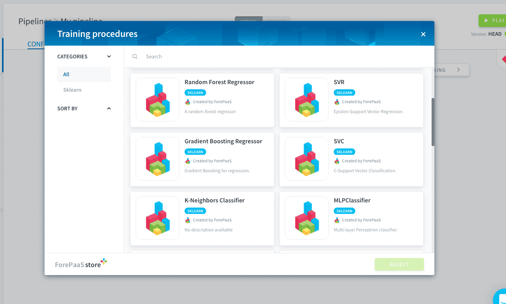
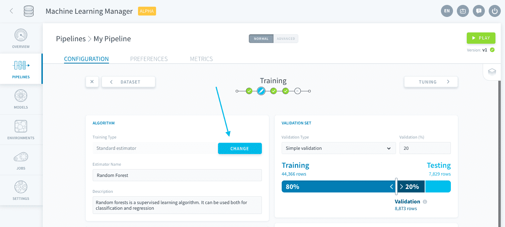

# 標準推定器
パイプラインでは、業界で最も一般的な機械学習アルゴリズムの中から標準推定器を選ぶことができます。ForePaaSでは、現在、次のフレームワークがサポートされています。

* [Scikit Learn](https://scikit-learn.org/stable/index.html)
* Keras*（準備中！）*

> 標準推定器に必要なアルゴリズムが見つからない場合は、「**Custom Estimator（カスタム推定器）**」オプションを使用して独自のスクリプトをアップロードすることもできます。  
[カスタム推定器の詳細を確認する](/jp/product/ml/pipelines/configure/training/custom-estimator.md)

---
## 標準推定器の追加

「*Standard Estimator（標準推定器）*」を選択すると、モデルで使用するアルゴリズムを選択するためのストアカタログが開きます。

それぞれのユースケースに応じて、[分類器](https://en.wikipedia.org/wiki/Statistical_classification)および[回帰器](https://en.wikipedia.org/wiki/Regression_analysis)から選択する必要があります。各アルゴリズムのカテゴリは、それぞれのタグで確認できます。

---
## パイプラインの推定器の変更

パイプラインの中核的な要素である推定器を変更するには、「Training（学習）」ページで「**Change（変更）**」ボタンをクリックします。

!> パイプラインの推定器を変更すると、調整画面で以前に生成されたハイパーパラメータのすべての組み合わせを含めて、「[Training（学習）](/jp/ml/pipelines/configure/training/index)」および「[Tuning（調整）](/jp/ml/pipelines/configure/tuning/index)」ステップの設定はすべて消去されます。以前の推定器によって生成された保存済みのモデルが削除されることは**ありません**。

---
## ライブラリと依存関係の管理

「Dependencies（依存関係）」パネルでは、パイプラインの実行に必要なすべてのパッケージの要件を管理できます。 

{ライブラリと依存関係}(#/jp/product/ml/pipelines/configure/training/dependencies.md)

---
## スコア評価と検証の構成

モデルの中核的な要素である基本アルゴリズムを選択した後に、公正な形で評価を行う必要があります。検証およびスコア評価関数の設定方法をご確認ください。

{スコア評価と検証の設定}(#/jp/product/ml/pipelines/configure/training/validation.md)

---
##  サポートが必要な場合🆘

> お探しの情報は見つかりましたか。サポートが必要な場合は、プラットフォームの「*Support（サポート）*」ページから直接依頼を送信することができます。また、support@forepaas.com宛にメールを送付することもできます。

{サポートに質問を送付する🤔}(https://support.forepaas.com/hc/en-us/requests)