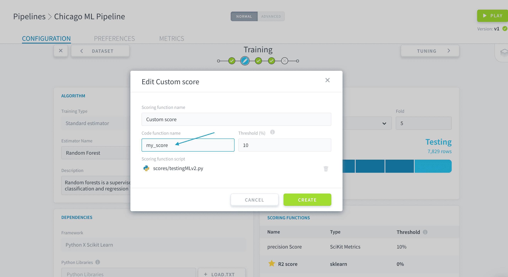

# スコア評価と検証

パイプラインで学習を行ったモデルのパフォーマンスを評価する場合は、**公正な形でスコア評価を行う**ことをお勧めします。スコアの結果は常に、モデルのスコア評価を行うデータセットに依存します。

?> 特定のデータセットに対するモデルのスコア評価では、モデルを使用してデータセット内の各データポイントに対して予測を行い、基準のスコア評価関数を使用して予測と真値との間のずれを定量化します。 

それぞれが選択したデータセットに対してモデルのスコア評価を行うことができます。ただし、モデルの学習に使用したデータでスコア評価を行うことはお勧めできません。これは、新しいデータに対するモデルの汎化能力を評価する必要があるためです。ForePaaSのパイプラインでは、[テスト用データセット](jp/product/ml/pipelines/configure/dataset/input.md?id=train-test-split)と[検証用データセット](jp/product/ml/pipelines/configure/training/validation.md?id=validation)の**2種類のデータセットでモデルのスコア評価を行うことができます**。 

* [検証用セットの指定](jp/product/ml/pipelines/configure/training/validation.md?id=validation)
  * [単純検証](jp/product/ml/pipelines/configure/training/validation.md?id=simple-validation)
  * [交差検証](jp/product/ml/pipelines/configure/training/validation.md?id=cross-validation)
* [1つまたは複数のスコア評価関数の選択](jp/product/ml/pipelines/configure/training/validation.md?id=scoring)
  * [標準スコア評価関数](jp/product/ml/pipelines/configure/training/validation.md?id=standard-scoring-function)
  * [カスタムスコア評価関数](jp/product/ml/pipelines/configure/training/validation.md?id=custom-scoring-function)


---
## 検証

?> 検証は、[最適なモデルを選択](jp/product/ml/pipelines/configure/validation/index)するために、最初の学習用セットからサブセットを抜き出して学習済みモデルのスコア評価に使用する、機械学習の手法です。抜き出したサブセットは*検証用セット*と呼ばれます。この検証用セットでは、最初の学習用セット（検証用に抜き出したサブセットを除く）で学習を行ったモデルの公正な評価を行うことができます。また、最終的なモデル評価（汎化誤差の定量化）を行うため、テスト用データセットを確実に分離することができます。  
[検証の詳細については、こちらを参照してください](https://en.wikipedia.org/wiki/Training,_validation,_and_test_sets)。

パイプラインでは、次のいずれかを行うことができます。
* [単純検証](jp/product/ml/pipelines/configure/training/validation.md?id=simple-validation)
* [交差検証](jp/product/ml/pipelines/configure/training/validation.md?id=cross-validation)

### 単純検証
単純検証では、検証用セットとして使用するため、最初の学習用セットのサブセットを抜き出します。これを使用する場合は、「Validation Type（検証タイプ）」で「*Simple validation（単純検証）*」を選択します。


スライダーを動かすか、「Validation（検証）」フィールドに求める割合を入力して、**最初の学習用セットの割合**として検証用セットのサイズを指定します。


> 検証用セットのサイズを*0*にすると、このパイプラインの検証は無効になります。

学習ジョブが[起動される](jp/product/ml/pipelines/execute/index?id=training-jobs)と、**生成されたモデルのスコア評価が検証用セットに対して自動的に行われます**。このパイプラインの残りの部分で、スコア評価の結果は*検証スコア*と呼ばれます。検証スコアの計算に使用されるスコア評価関数は学習ジョブごとに1つだけです。これは[「Tuning（調整）」ステップ](jp/product/ml/pipelines/configure/tuning)の「Visual Options（視覚オプション）」パネルに入力されたスコア評価関数です。


### 交差検証
[交差検証](https://en.wikipedia.org/wiki/Cross-validation_(statistics))では、最初の学習用セットを所定のサブセット数（*分割数*という）に分割します。その後、各サブセットを[単純検証](jp/product/ml/pipelines/configure/training/validation.md?id=simple-validation)のセットとして使用し、サブセット数の回数だけ単純検証を続けて実行します。この方法では、最初の学習用セットのデータポイントを残さず使用できます。

!> 選択した分割数と同じ数だけモデルの学習を繰り返すため、**交差検証には非常に多くのリソースが必要になる**ことがあります。

これを使用する場合は、「Validation Type（検証タイプ）」で「*k-fold cross validation（k-分割交差検証）*」を選択します。


「**Fold（分割）**」に選択した分割数を入力します。


学習ジョブが[起動される](jp/product/ml/pipelines/execute/index?id=training-jobs)と、**生成されたモデルのスコア評価がパイプラインにより自動的に個々の分割に対して続けて実行されます**。その後、スコア評価結果の*平均値*をとって、パイプラインの残りの部分に表示される**検証スコア**が生成されます。 

検証スコアの計算に使用されるスコア評価関数は学習ジョブごとに1つだけです。これは[「Tuning（調整）」ステップ](jp/product/ml/pipelines/configure/tuning)の「Visual Options（視覚オプション）」パネルに入力されたスコア評価関数です。


---
## スコア評価

「Training（学習）」ステップの最初のところで推定器を選択すると、デフォルトのスコア評価関数が自動的にリストに追加されます。このデフォルトのスコアは、推定器が[分類器](https://en.wikipedia.org/wiki/Statistical_classification)か[回帰器](https://en.wikipedia.org/wiki/Regression_analysis)かに左右されます。


テストジョブが[起動される](jp/product/ml/pipelines/execute/index?id=testing-jobs)と、**リスト内のすべてのスコアが*テスト用セット*に対して同時に計算されます**。

それぞれのスコア評価関数には**しきい値**があります。このしきい値は、モデルを保存するのに検証セットとテスト用セットの両方で到達しなければならない最小スコアです。
* 学習ジョブの場合：選択したスコアが検証セットでしきい値に到達しない場合、モデルは保存されません。
* テストジョブの場合：**いずれか**のスコアがしきい値に到達しない場合、モデルは保存されません。

スコア評価関数の横にある**星印**⭐アイコンをクリックすると、スコア評価関数をプライマリに設定できます。プライマリに設定したスコア評価関数は、パイプラインの残りの部分でデフォルトで表示されるスコアになります。


新しいスコア評価関数を追加する際には、最も一般的として選別されたスコアのカタログの中から[標準スコア評価関数](jp/product/ml/pipelines/configure/training/validation.md?id=standard-scoring-function)を選択するか、独自の[カスタムスコア評価スクリプト](jp/product/ml/pipelines/configure/training/validation.md?id=custom-scoring-function)をアップロードすることができます。

### 標準スコア評価関数
標準スコア評価関数を追加するには、「**Add（追加）**」をクリックします。 


ストアで必要な標準推定器を選択し、「**Select（選択）**」をクリックします。


新しいスコアに対するデフォルトのしきい値が自動的に設定されます。これを変更するには、新しいスコアの行の**編集**✏️アイコンをクリックします。


続いて、新しく指定するしきい値（%）を入力します。


### カスタムスコア評価関数

独自のカスタムスコア評価スクリプトを追加するには、「**Add（追加）**」をクリックします。 


ストアで「*Custom score（カスタムスコア）*」を選択し、「**Select（選択）**」をクリックします。


名前としきい値を入力し、Pythonのカスタムスコア評価スクリプトを専用のボックスにアップロードします。この*.py*スクリプトでは、予測と真値を表す2つの配列を取る関数が指定され、
スコアを表す数値を返す必要があります。


上記の関数の名前を「**Code function name（コード関数名）**」に書き込みます。



#### カスタムスクリプトのテンプレート

以下にカスタムスコア評価スクリプトのテンプレートを示します。

```py
import logging

logger = logging.getLogger(__name__)


def customfunc(y, y_pred, **kwargs):

    logger.info("BEGIN function customfunc")

    # Function goes in here
    print(y, y_pred)
    logger.info("END function customfunc")
    return 0.8
```

---
##  サポートが必要な場合🆘

> お探しの情報は見つかりましたか。サポートが必要な場合は、プラットフォームの「*Support（サポート）*」ページから直接依頼を送信することができます。また、support@forepaas.com宛にメールを送付することもできます。

{サポートに質問を送付する🤔}(https://support.forepaas.com/hc/en-us/requests)