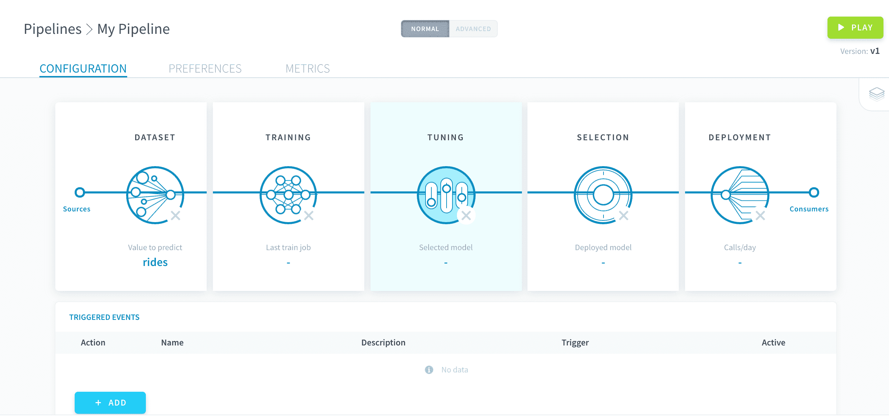
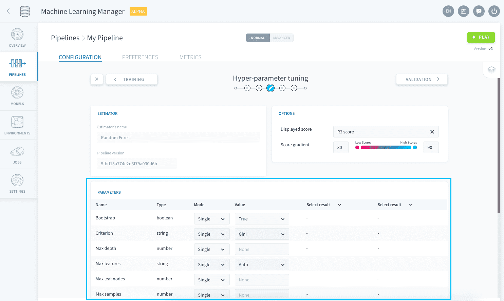
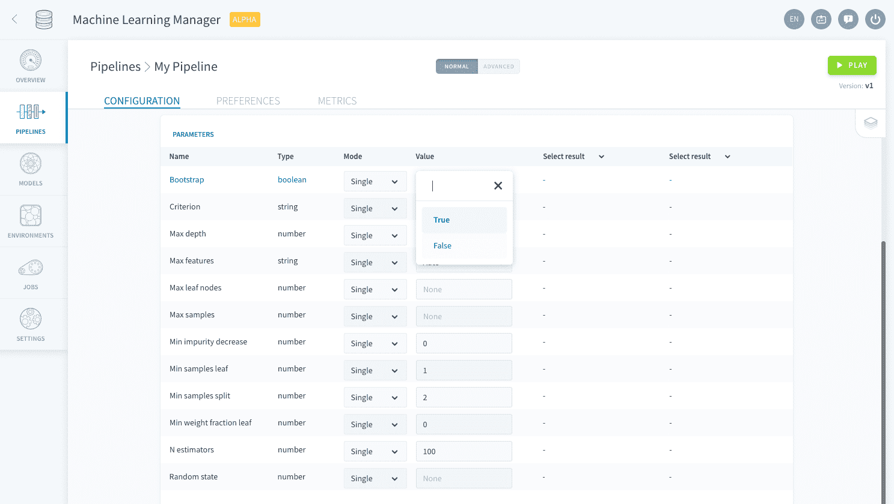
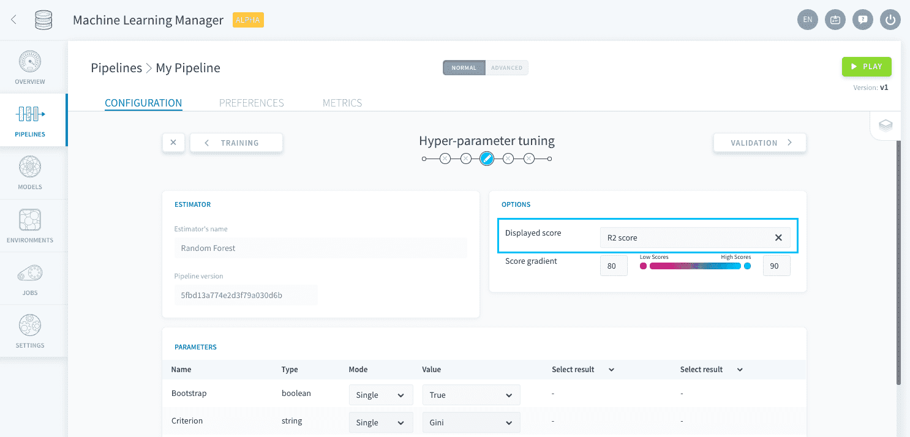
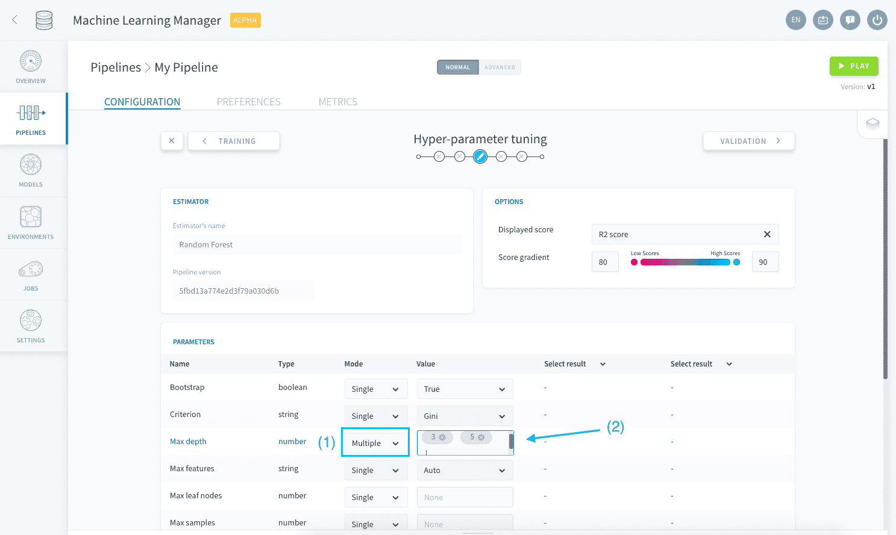

# ハイパーパラメータの調整

ハイパーパラメータの調整は、[学習ステップ](/jp/product/ml/pipelines/configure/training/index)と密接に関連したパイプラインの設定ステップで、パイプラインで実装した推定器の微調整を行うことができます。

?> ハイパーパラメータは、機械学習の推定器の主要な変数であり、学習データを使用して学習を行うものではありません。ハイパーパラメータはモデルを構成する際にハードコードする必要があり、学習ジョブを実行するのに不可欠です。ハイパーパラメータの詳細については、[Wikipediaの関連するページ]()を参照してください。

---
## 特定のハイパーパラメータ値の設定
ハイパーパラメータの調整画面には、[学習の設定](/jp/product/ml/pipelines/configure/training/index)時に選択した推定器に関連するすべてのハイパーパラメータが列挙されます。 

個々のハイパーパラメータには、デフォルト値が入力されています。特定のハイパーパラメータの設定値を変更するには、「*Value（値）*」列で設定値を編集します。 

パイプラインの[実行](/jp/product/ml/pipelines/execute/index)時に、学習ジョブはこの機械学習の推定器のハイパーパラメータ設定を使用します。検証方法として使用するスコア評価関数は、「Visual Options（視覚オプション）」パネルで設定できます。

---
## さまざまな値の検討
どのように設定すべきかが分からない場合には、ForePaaSの調整画面で、生成されるモデルのスコアに対するさまざまなハイパーパラメータ値の影響を検討することもできます。

「**Mode（モード）**」列で「*Multiple（複数）*」を選択し、ハイパーパラメータとして検討するすべての値を入力します。 

これにより、選択した値のあらゆる組み合わせが作成され、パイプラインが[実行](/jp/product/ml/pipelines/execute/index.md?id=Training_jobs)されるたびにこれらすべての組み合わせの学習が行われ、（「Visual Options（視覚オプション）」パネルで指定された関数を使用して）検証セットに対するスコア評価が行われます。 

!> 生成されるモデルのすべての組み合わせの学習と評価を行う必要があるため、特に[交差検証](/jp/product/ml/pipelines/configure/training/validation.md)を使用する場合は、選択したハイパーパラメータのあらゆる組み合わせを検討するのに**長い時間と大きなリソースが必要**になります。

複数のハイパーパラメータの組み合わせを使用してパイプラインを[実行](/jp/product/ml/pipelines/execute/index.md?id=Training-jobs)すると、調整画面にはすべての検証スコアが表示されますが、**検証スコアの最も高いモデルのみがデプロイ用に保存されます**。この保存されたモデルは、[モデルの選択ステップ](/jp/product/ml/pipelines/configure/validation/index)に表示されます。

{デプロイするモデルの選択}(/#/jp/product/ml/pipelines/configure/validation/index.md)