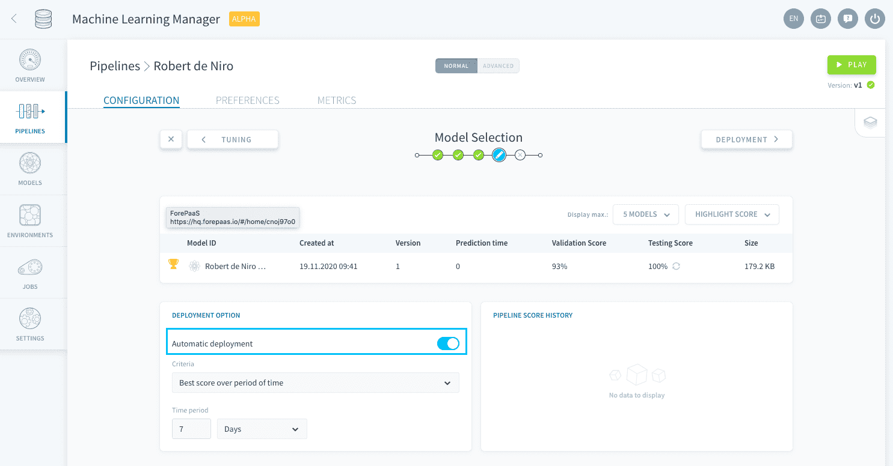

# モデルの自動デプロイ

この機能では、このステップで手動で実行できるすべての操作を自動化し、スコアや実行時間に基づいてすべてのバージョンの中から好みのモデルをデプロイできます。

この機能を有効にするには、「Deployment Option（デプロイオプション）」パネルで「**Automatic Deployment（自動デプロイ）**」をオンにします。 

デプロイするモデルを選択するための基準を指定する必要があります。ForePaaSでは、次の基準から選択することができます。

* [Best score over period of time（一定期間の最良スコア）](jp/product/ml/pipelines/configure/validation/auto-deploy.md?id=best-score-over-period-of-time)
* [Best prediction time over period of time（一定期間の最良予測時間）](jp/product/ml/pipelines/configure/validation/auto-deploy.md?id=best-prediction-time-over-period-of-time)

### Best score over period of time（一定期間の最良スコア）

**パラメータ**：*Time period（期間）*

過去の[*Time period*]で検証スコアが最も良いモデルが自動的にデプロイされます。 

### Best prediction time over period of time（一定期間の最良予測時間）

🚧 準備中!

**パラメータ**：*Time period（期間）*

過去の[*Time period*]で予測時間が最も良いモデルが自動的にデプロイされます。 

--- 
## その他のオプションが必要な場合
ForePaaSでは自動化オプションの追加と更新を積極的に進めています。お客様のプロジェクトに必要な機能が見つからない場合は、弊社の[ロードマップポータル]()を通じてご意見をお寄せください💡。  

サポートが必要な場合は、「*Support（サポート）*」ページから依頼を送信するか、support@forepaas.com宛にメールを送ることができます。