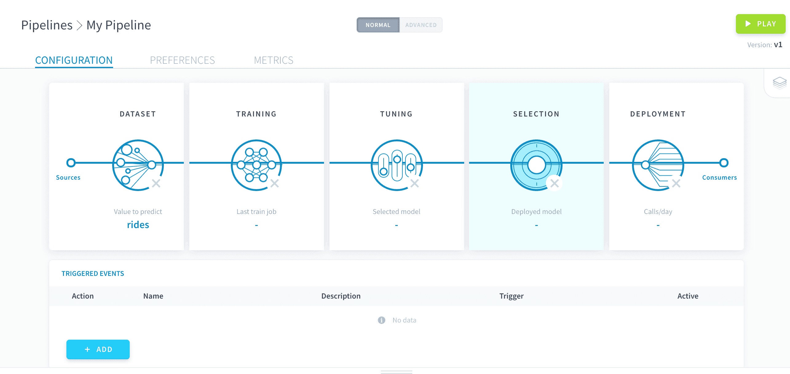
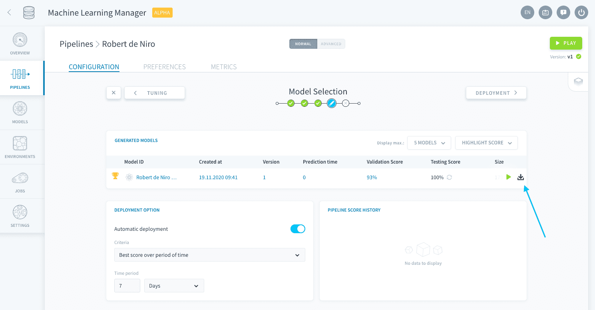
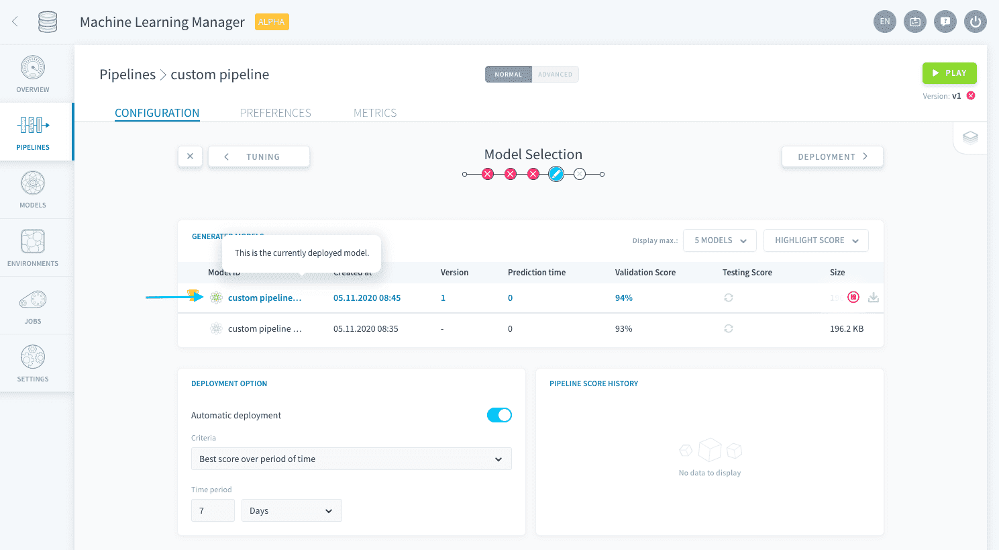
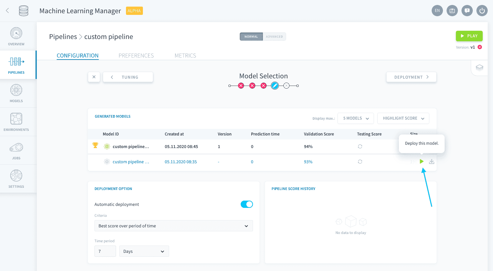
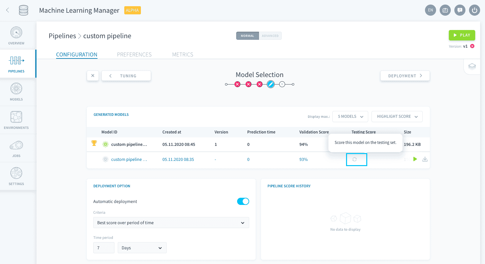
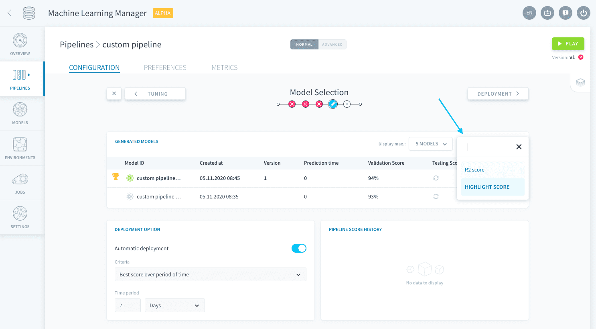
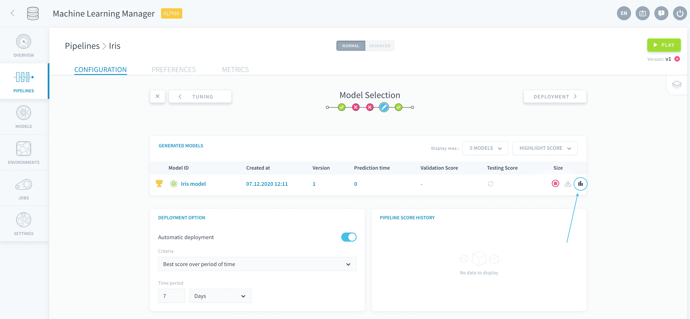

# モデルの選択

モデルの選択は、**一定期間におけるパイプラインのすべての学習済みモデルを比較**して、運用環境にデプロイするモデルを選択するステップです。**_モデル_**という表記は、*学習用データ*でフィッティングされた*推定器とパラメータ*の2つの要素の組み合わせを表します。 

このステップは、デプロイ済みのモデルの状態をいつでも経時的にモニタリングできるコントロールセンターのようなものです。必要に応じて、より正確なモデルや効率的なモデルに切り替えることができます。

!> パイプラインでは複数の学習済みモデルを保存できますが（「Model Selection（モデルの選択）」ページにはすべてのモデルが表示されます）、デプロイして予測を行えるのは1つだけです。

ここでは、次のことを行うことができます。
* [モデルのバージョンの管理](jp/product/ml/pipelines/configure/validation/index.md?id=manage-versions)
* [モデルのデプロイ](jp/product/ml/pipelines/configure/validation/index.md?id=deploy-model)
* [スコアの比較](jp/product/ml/pipelines/configure/validation/index.md?id=scores)
* [モデルの自動デプロイのセットアップ](jp/product/ml/pipelines/configure/validation/index.md?id=set-up-automatic-deployment-of-models)

---
## 学習済みモデルの管理

このページで最も重要なのは、**「Generated Models（生成済みモデル）」ボード**です。ここには、パイプラインが作成されてからフィッティングが行われたすべてのモデルが列挙されます。  

> [ハイパーパラメータの調整ステップ](jp/product/ml/pipelines/configure/tuning/index)ではすべての組み合わせが保存される訳ではなく、検証スコアの最も良かったものだけが保存されることに注意してください。

### バージョンの管理

ここでは、モデルのバージョンは、モデルを生成するのに使用された設定を含むパイプラインのバージョンと同じです。このため、個々の予測がどのようにして行われたのかを追跡することができます。 

これまでに保存されたすべてのモデルバージョンが表形式で表示されます。📥アイコンをクリックすると、特定のモデルバージョンをダウンロードすることができます。 

### モデルのデプロイ

緑色の原子⚛️アイコンの付いた一番上にあるモデルは、パイプラインに現在デプロイされているモデルです。つまり、[デプロイオプションのステップ](jp/product/ml/pipelines/configure/deployment/index)に記載された指定内容（コンシューマー）を使用して推論を行うのに使用されているモデルです。  

行の末尾にある**再生▶️ボタン**をクリックすると、選択した別のモデルを手動でデプロイすることができます。

### スコア

また、「Generated Models（生成済みモデル）」のリストには、（[検証セット](jp/product/ml/pipelines/configure/training/validation)に対して評価された）「**Validation Score（検証スコア）**」と（[テストセット](jp/product/ml/pipelines/configure/dataset/input.md?id=train-test-split)に対して評価された）「**Testing Score（テストスコア）**」の両方が表示されます。デフォルトでは、使用されるリソースを最小限に抑えるため、テストスコアは計算されません。「*Testing Score（テストスコア）*」列の**リフレッシュ🔄ボタン**をクリックすると、テストスコアを手動で計算することができます。

> 検証スコアが最も高いモデルにはトロフィー🏆の印が付いていますので、簡単に見つけることができます。

これらの列で使用されるデフォルトの**スコア評価関数**は、「*Highlight Score（最高スコア）*」です。これは、[学習ステップで⭐を付けたスコア評価関数](jp/product/ml/pipelines/configure/training/validation)です。別のスコア評価関数を用いた場合の結果を表示するには、表の右上にあるドロップダウンメニューをクリックして、学習ステップで追加したスコア評価関数の中から関数を選択します。

最後に、**詳細ページ**で特定のモデルの複数の関数のスコアを並べて比較することもできます。これを開くには、モデルの行の末尾にある**統計📊アイコン**をクリックします。

---
## モデルの自動デプロイのセットアップ

「Model Selection（モデルの選択）」ステップの重要な機能の1つに、特定の条件に基づいてモデルの自動デプロイを設定する機能があります。 

{モデルを自動デプロイする方法を確認する}(#en/product/ml/pipelines/configure/validation/auto-deploy.md)

---
##  サポートが必要な場合🆘

> お探しの情報は見つかりましたか。サポートが必要な場合は、プラットフォームの「*Support（サポート）*」ページから直接依頼を送信することができます。また、support@forepaas.com宛にメールを送付することもできます。

{サポートに質問を送付する🤔}(https://support.forepaas.com/hc/en-us/requests)