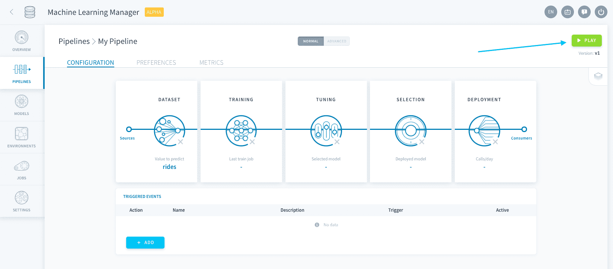
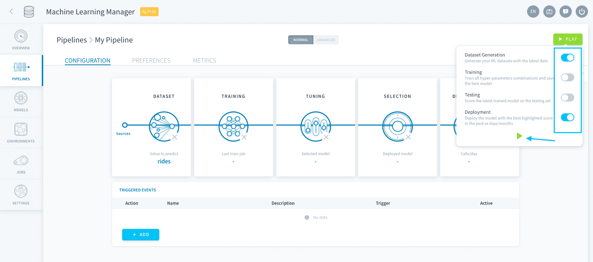

# パイプラインの実行

パイプラインの設定が済んだら、パイプラインを実行して**ジョブ**と呼ばれるさまざまなタスクを遂行できます。これらのジョブはForePaaSテクノロジーを使用して実行されるため、膨大な処理データ量や高頻度なデータ処理に対応することができます。 

パイプラインの実行は、ライフサイクルを通じてモデルを進化させていくためのバックボーンです。指定された設定に基づいて、経時的に生じる追加データの取り込み、モデルの再学習、新しいモデルのデプロイ、予測が行われます。 

---
## パイプラインのジョブ

手動または[トリガー](jp/product/ml/pipelines/execute/triggers)を通じて実行できる**4種類**のジョブが存在します。

* [データセットの生成ジョブ](jp/product/ml/pipelines/execute/index.md?id=dataset-generation-jobs)
* [学習ジョブ](jp/product/ml/pipelines/execute/index.md?id=training-jobs)
* [テストジョブ](jp/product/ml/pipelines/execute/index.md?id=testing-jobs)
* [デプロイジョブ](jp/product/ml/pipelines/execute/index.md?id=deployment-jobs)

パイプラインのジョブを手動で実行するには、右上にある**再生▶️ボタン**をクリックします。

続いて、実行するジョブと実行方法を指定します。

### データセットの生成ジョブ

データセットの生成ジョブは、データ入力に基づいて学習用、テスト用、および検証用データセットの作成（または追加）を行うのに使用します。

### 学習ジョブ

学習ジョブは、アルゴリズムとハイパーパラメータの組み合わせに基づいてモデルの学習を行い、検証用セットに対してスコア評価を行うのに使用します。

### テストジョブ

テストジョブは、追加されたすべてのスコア評価関数を使用して、テストセットに対してモデルを評価するのに使用します。

### デプロイジョブ

デプロイジョブは、予測を行うモデルのインターフェースである推論APIをデプロイするのに使用します。

---
## トリガーのセットアップ

手動で再生▶️ボタンをクリックする代わりに、**特定のタイミングやイベントが発生したときにパイプラインを実行**するようにトリガーを設定できます。 

{パイプラインのトリガー}(#/jp/product/ml/pipelines/execute/triggers.md)

---
## パイプラインの基本設定の管理

「Preferences（基本設定）」タブでは、**割り当てリソース、タイムアウト、ログ設定**などのパイプラインの実行に関する基本的なオプションを設定し、必要に応じてデータセットをリセットすることもできます。

{パイプラインの基本設定}(#/jp/product/ml/pipelines/execute/preferences.md)

---
##  サポートが必要な場合🆘

> お探しの情報は見つかりましたか。サポートが必要な場合は、プラットフォームの「*Support（サポート）*」ページから直接依頼を送信することができます。また、support@forepaas.com宛にメールを送付することもできます。

{サポートに質問を送付する🤔}(https://support.forepaas.com/hc/en-us/requests)