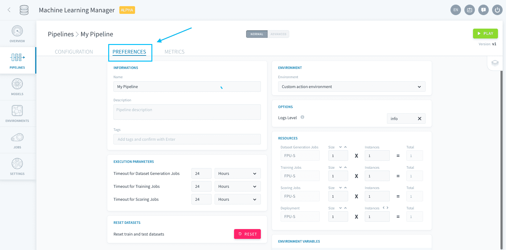
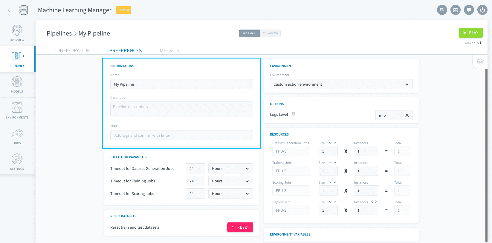
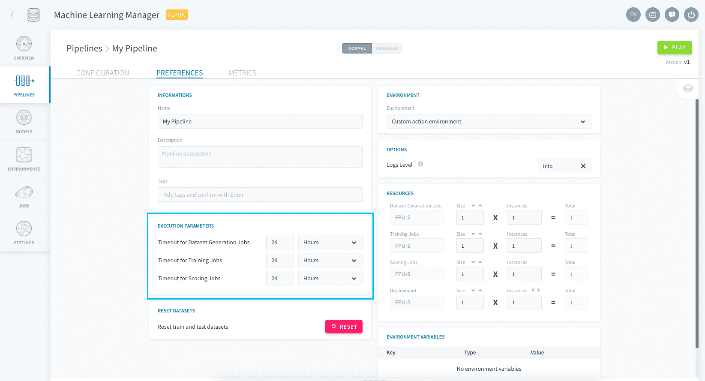
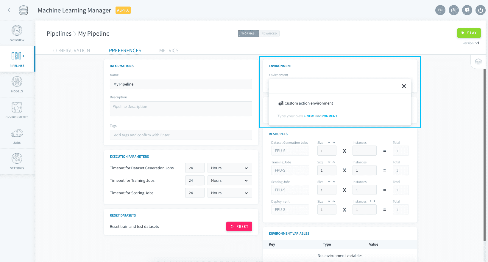
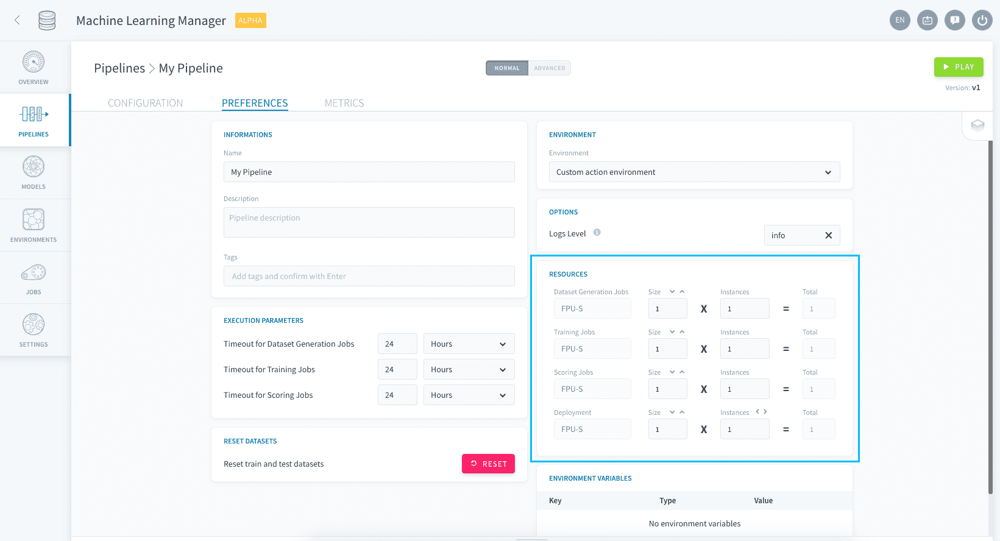
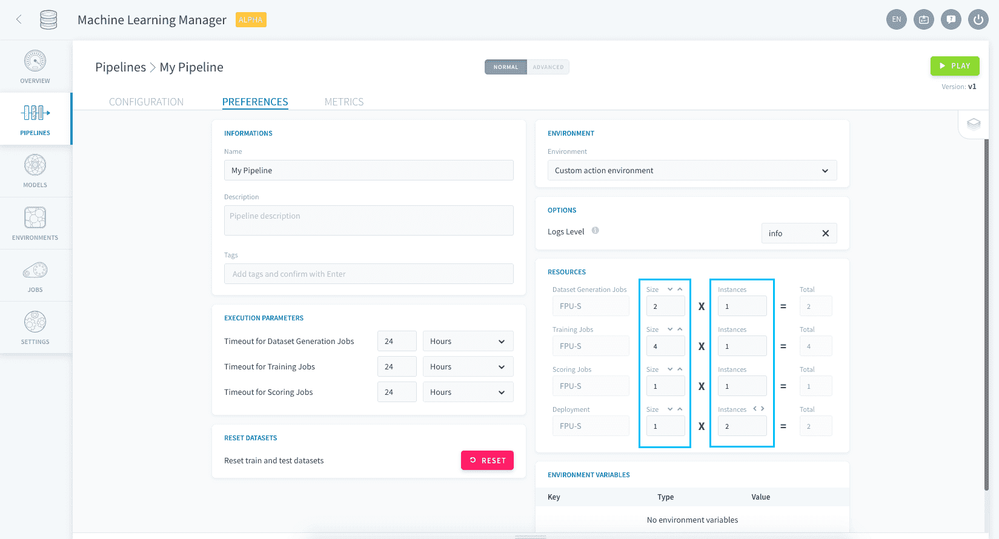
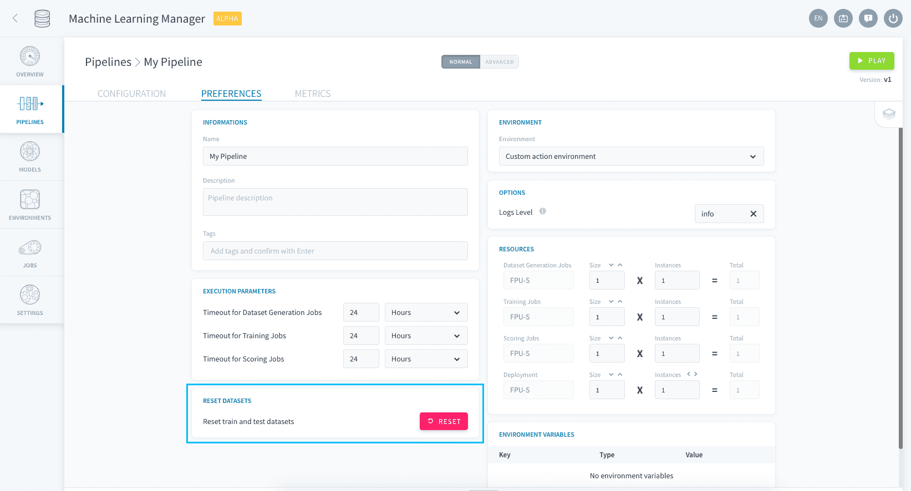

# パイプラインの基本設定

ForePaaSの各パイプラインには実行に関する複数の設定が存在します。これらの設定は、パイプラインのエディションメニューの「Preferences（基本設定）」タブで管理できます。 

以下の主要な設定が存在します。

* [パイプライン情報](jp/product/ml/pipelines/execute/preferences.md?id=pipeline-information)
* [タイムアウトオプション](jp/product/ml/pipelines/execute/preferences.md?id=timeout-options)
* [環境オプション](jp/product/ml/pipelines/execute/preferences.md?id=environment-options)
  * [リソース](jp/product/ml/pipelines/execute/preferences.md?id=resources)
* [データセットのリセット](jp/product/ml/pipelines/execute/preferences.md?id=reset-datasets)

---
## パイプライン情報

「Informations（情報）」ボックスでは、パイプラインの名前、説明、タグを設定できます。 

---
## タイムアウトオプション

「Execution Parameters（実行パラメータ）」ボックスでは、タイムアウトとエラーのオプションを設定できます。

**タイムアウト**はジョブが終了していない場合にジョブを中断するまでの経過時間です。4つのすべてのジョブに、異なる時間を設定できます。

!> パイプライン（連続する複数のジョブ）の実行中にいずれかのジョブが失敗した場合、**パイプライン全体が中断され、次のジョブは実行されません**。

---
## 環境オプション

### 環境の設定

画面の右側にあるボックスは、[DPEアクション](/jp/product/dpe/actions/settings/index)の環境設定と類似するものです。デフォルトで適用されている環境はありません。すべての設定は「Preferences（基本設定）」ページでカスタマイズできます。  
一連の設定を、作成するすべてのパイプラインで整合性のあるものにする場合は、**環境レベルでこれらの設定を指定します**。サイドバーの「Environments（環境）」に移動して環境を作成し、パイプラインの「Preferences（基本設定）」ページの関連する環境ボックスで作成した環境を指定して各パイプラインに環境を適用します。

### リソース

「Resources（リソース）」ボックスでは、[機械学習ジョブ](jp/product/ml/pipelines/execute/index.md?id=pipeline-jobs)の種類ごとに専用のリソースを指定できます。

リソースはFPU単位で指定します。ジョブの種類ごとに割り当てられるリソースの合計は、**コンピューティングインスタンス数**に各インスタンスの**サイズ（FPU単位）**を乗じたものになります。

{FPUとリソースの詳細を確認する}(#/jp/product/billing/resources/index.md)

> 例えば、上記のスクリーンショットの場合、学習ジョブは4 FPUのインスタンスを1つ使用し（合計4 FPU）、デプロイジョブは1 FPUのインスタンスを2つ使用します（合計2 FPU）。

---
## データセットのリセット

デフォルトでは、パイプラインの学習用データセットとテスト用データセットが時間を経ても互いに混じり合うことがない設計になっています。

「Preferences（基本設定）」ページで以下のボタンをクリックすると、特定のパイプラインの学習用データセット、テスト用データセット、および検証用データセットを手動でリセットすることができます。

?> パイプラインのデータセットのリセットは通常行う操作ではありません。学習用データの構造が大幅に変更された場合にのみ行うようにしてください。 

---
##  サポートが必要な場合🆘

> お探しの情報は見つかりましたか。サポートが必要な場合は、プラットフォームの「*Support（サポート）*」ページから直接依頼を送信することができます。また、support@forepaas.com宛にメールを送付することもできます。

{サポートに質問を送付する🤔}(https://support.forepaas.com/hc/en-us/requests)