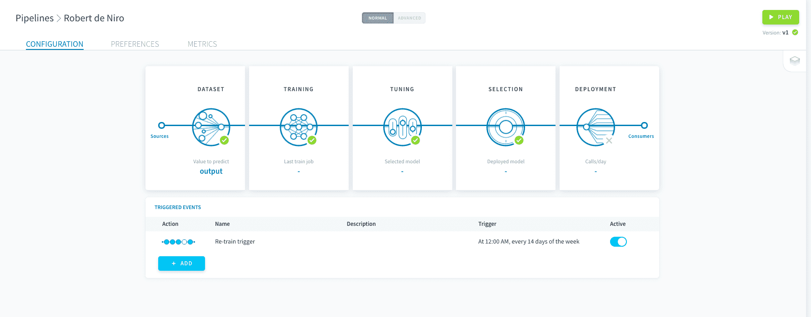
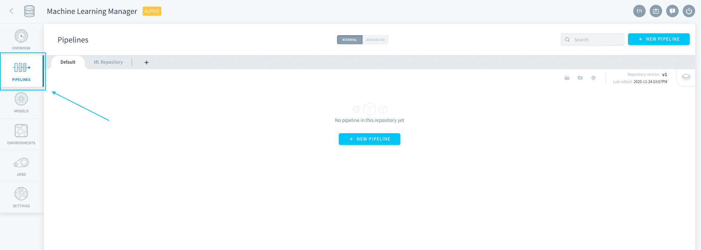
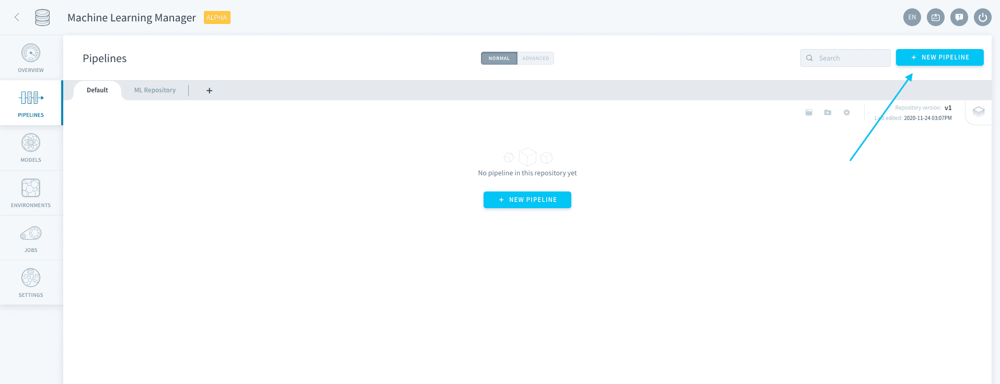
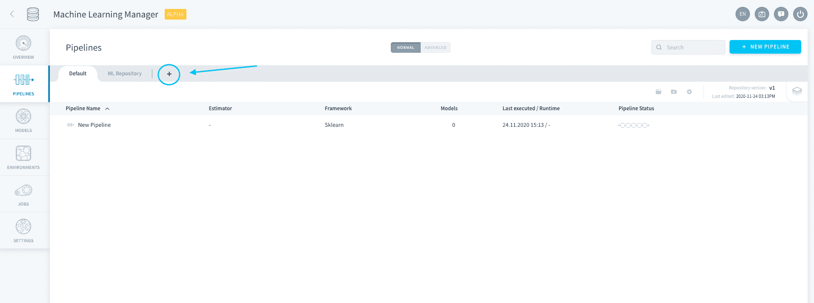
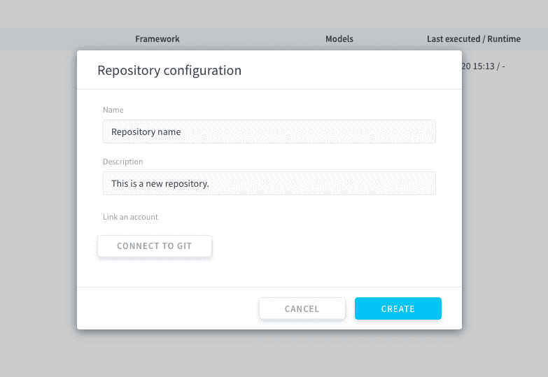
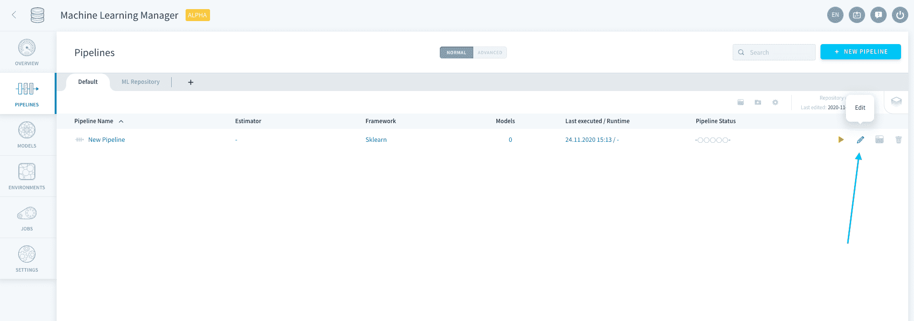
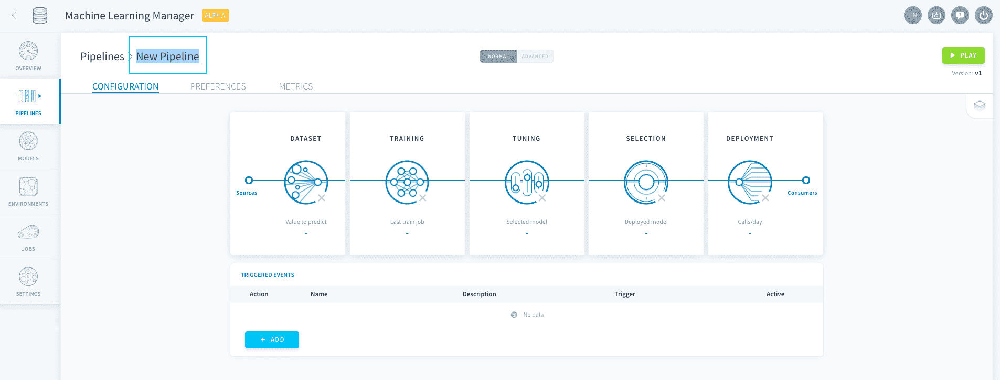
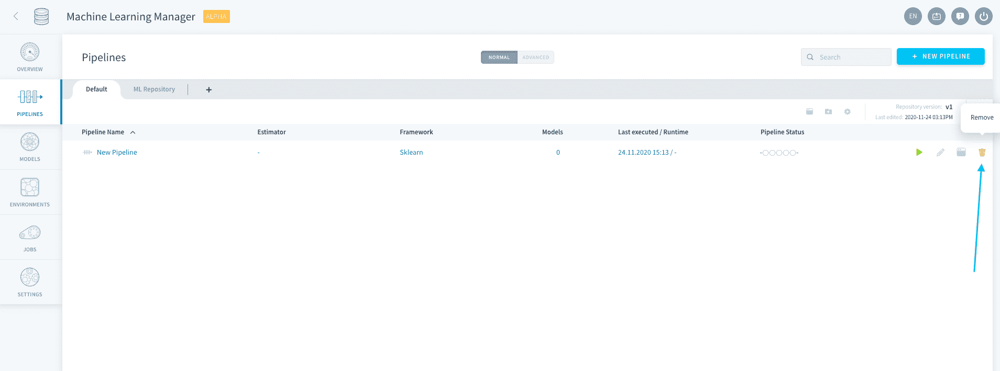

# パイプライン

パイプラインは、**機械学習モデルを新規に作成し、モデルをデプロイして予測を行う**ための機能です。パイプラインは実運用に対応したエンドツーエンドの環境です。パイプラインでは、追跡可能な形で[ライフサイクル](jp/product/ml/pipelines/configure/index?id=manage-execution-options)を通じてモデルを進化させていくことができます。

> パイプラインでは複数の学習済みモデルとそれぞれのバージョンを保存できますが、デプロイして予測を行えるのは1つだけです。

---
## パイプラインの作成

パイプラインを作成するには、機械学習コンポーネントの「**Pipelines（パイプライン）**」に移動します。 

*機械学習プロジェクト*をまだ開始していない場合は、最初に[リポジトリの初期設定](/jp/product/ml/pipelines/index.md?id=pipeline-repositories)を行います。それ以外の場合は、右上にある「**New Pipeline（新規パイプライン）**」をクリックします。 

パイプラインが作成されるのに数秒かかります。作成されたパイプラインは自動保存モードになっています。パイプラインの設定はいつでも終了し、再開することができます。

{パイプラインの設定}(#/jp/product/ml/pipelines/configure/index.md)

---
## パイプラインの管理

### パイプラインのリポジトリ

パイプラインはForePaaSのリポジトリに保存されます。新しいリポジトリを初期設定するには、「Pipelines（パイプライン）」タブで➕記号をクリックします。

パイプラインの名前と説明を編集します。また、既存のGitリポジトリに接続することもできます。

### パイプラインの編集

リポジトリのリストでパイプラインを設定するには、**ペン🖊️アイコン**をクリックするか、パイプラインをダブルクリックします。

パイプラインの設定時にパイプラインの名前を変更するには、右上にあるパイプライン名をダブルクリックします。

リポジトリのリストからパイプラインを削除するには、**ごみ箱🗑️アイコン**をクリックします。

!> パイプラインを削除しても、そのパイプラインの保存済みモデルは削除されません。削除されたパイプラインで生成されたモデルには、[「Models（モデル）」タブ](/jp/product/ml/models/index.md)でアクセスできます。

---
##  サポートが必要な場合🆘

> お探しの情報は見つかりましたか。サポートが必要な場合は、プラットフォームの「*Support（サポート）*」ページから直接依頼を送信することができます。また、support@forepaas.com宛にメールを送付することもできます。

{サポートに質問を送付する🤔}(https://support.forepaas.com/hc/en-us/requests)