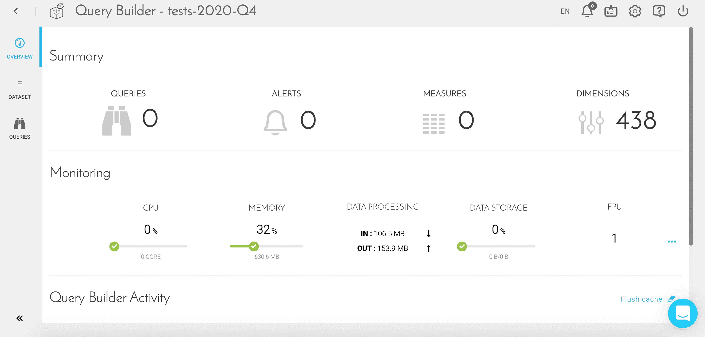

# Query Builder

Query Builderはプラットフォームに**組み込まれたクエリツール**です。クエリはForePaaS上で作成されたすべてのアプリケーションに統合できます。

Query Builderを使用すると、ユーザーは次のことを行うことができます。
* 要求およびビジネスKPIの作成と一元化
* ローコードアプローチによりスキーマの抽象化とクエリ言語を用いて、Data Managerからデータを抽出
* メタデータをキャッシュしてクエリのパフォーマンスを向上
* クエリとその属性を確認（ダイヤモンド）

---
## コンポーネントの概要

このコンポーネントには、次の2つの主要な機能が存在します。
* [データセット](/jp/product/query-builder/dataset)：既存のすべてのデータセット（ダイヤモンド、ディクショナリ、Prim、Mart、機械学習）の探索
* [クエリ](/jp/product/query-builder/index.md?id=flexibility-meets-automation)：クエリの作成、表示、整理、編集を行い、デプロイするバージョンを管理

---
## 優れた柔軟性と自動化

### 柔軟なデータモデル

Data Managerのスキーマは、次のようにして次第に変化していきます。
* 新しいデータソース（すなわち新しいKPI）が登場する
* Data Primのスキーマの変更や最適化が行われる
* メジャーテーブルやリポジトリの追加、削除、変更が行われる
* Data Martのスキーマの変更や最適化が行われる
* 集計テーブルの追加、削除、変更が行われる

BIプロジェクトが複雑化するほど、データスキーマと個々の属性を把握することが重要になります。時間を節約するため、ロールを明確に分離するのが合理的です。

クエリを実行する場所やクエリの実行方法は、属性を格納するスキーマ構造を管理するData Managerによって定義されます。このため、復元インターフェースやAPIの開発担当者がこれらを気にする必要はありません。

### 自動化されたマルチベースエンジン

これらのニーズに対応するため、Query Builderは環境に依存しないマルチベースエンジンを利用します。クエリ・エディター・インターフェースを介してクエリを設定すると、プラットフォームによってJSONオブジェクトが作成され、これがQuery BuilderのAPIに送信されて、ForePaaS上に保管された情報や利用可能な情報の要求が行われます。 

Query Builderでクエリを作成する場合、テーブル名を指定する必要はありません（特にビジュアル・ビルダー・モードを使用する場合）。ForePaaSのQuery Builderは、次のステップを実行して、**最適なテーブルを自動的に選択**します。

1. クエリを実行するのに必要なすべての属性をチェック（仮想属性を必要な属性に変換し、この必要な属性のリストに追加する）
2. 必要なすべての属性をもつすべての候補テーブルをチェック（クエリ不可のテーブルは除外）
3. 行数の少ないテーブルを選択

---

##  サポートが必要な場合🆘

> サポートの依頼が必要な場合は、いつでもプラットフォームの「*Support（サポート）*」タブから直接依頼を送信することができます。また、support@forepaas.com宛にメールを送付することもできます。

{サポートに質問を送付する🤔}(https://support.forepaas.com/hc/en-us/requests)