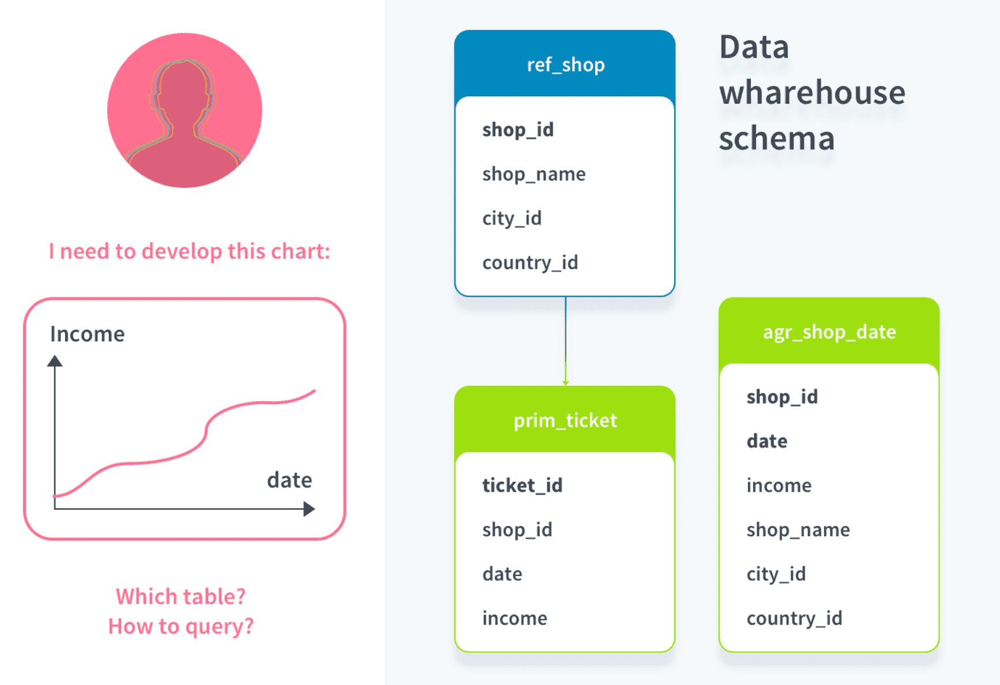
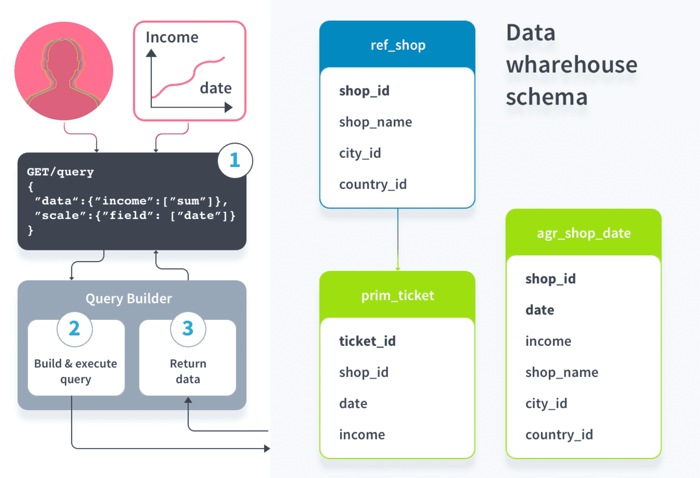
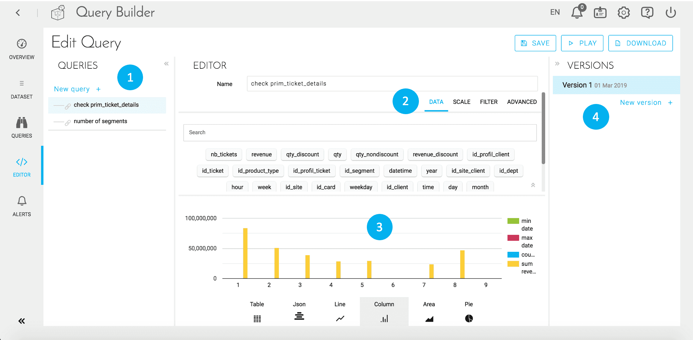

# クエリ

次はデータ表示です。クエリは、データプラント内に保管されたデータを外部にどのような形で表示するかを構成する方法です。

---

## ForePaaSでのクエリの作成

ForePaaSは適応型であるため、データに使用するストレージシステムは保管された情報の性質や量に応じて変化します。ForePaaSプラットフォームでは、Query Builderコンポーネントを介して、**独自のフレームワーク**を用いて保管情報のクエリを実行する一般的な手段が利用できます。例えば、最終的なダッシュボードの開発担当者が、日付（属性：date）ごとの売上高曲線（属性：income）を表示すると想定します。

このユーザーは、表示するデータ（データ：income）と、このデータの区切り（スケール：date）を指定して、**Query Builderインターフェース**でクエリを作成します（1）。この時点で、複数のテーブルに同じ属性が含まれているこの例において、Query Builderが**クエリに応答するのに最もふさわしいテーブル**を自動的に特定します（2）。この例では、「agr_shop_date」が日付ごとの集計データを含むMartテーブルであるため、このテーブルがQuery Builderによって選択されます。最後に、軽量のJSONオブジェクトとして**結果がユーザーに返されます**（3）。

この結果、各クエリは環境に依存しない**JSON形式の設定ファイル**で定義され、これをForePaaSが解釈してレスポンス（「リクエスト」）を返します。クエリを設定するには、シンプルな*ドラッグアンドドロップ・インターフェース*で直接クエリを設定するか、JSONコードを直接編集します（*詳細モード*）。

{ カスタムクエリを作成するのに使用できるすべてのパラメータを参照する}(#/jp/product/query-builder/queries/parameters/index.md)

---

## シンプルなクエリの作成と編集

「Queries（クエリ）」タブでは、1つまたは複数の分析アプリケーションで使用するシンプルなクエリの作成（およびクエリの復元のプレビュー）を行うことができます。クエリはJSONで編集されます。
1. 左側には、すでに作成済みのクエリが表示されます。
2. 中央には、データ、スライス、フィルターを介してクエリを構成するためのさまざまなフィールドが存在します。
3. 下部には、さまざまな形式で結果がビジュアル表示されます。
4. 異なる複数のバージョンを管理できます。

**詳細モード**では、制限や復元順序などの追加のパラメータをクエリに組み込むことができます。

{詳細モードを使用したクエリの設定}(#/jp/product/query-builder/queries/advanced-mode.md)

---

## 既存のクエリの管理
「Queries（クエリ）」タブでは、次のことを行うことができます。
* クエリの作成、削除、または編集
* クエリの複製
* フォルダーでのクエリの整理
* クエリIDのクリップボードへのコピー

既存のクエリを反復処理する場合は、クエリの複数のバージョンを作成するのがベストです。こうすることで、段階的にバリエーションを導入してテストを行うことができます。

{クエリでバージョンを使用する方法を確認する}(#/jp/product/query-builder/queries/versions)

---

Query Builderコンポーネントでは、データの準備を行うことができます。クエリの結果はAPIエンドポイントの出力として容易に公開できます。この方法については、次の記事を参照してください。

{APIを介してデータを公開する方法を確認する}(#/jp/product/api-manager/index.md)