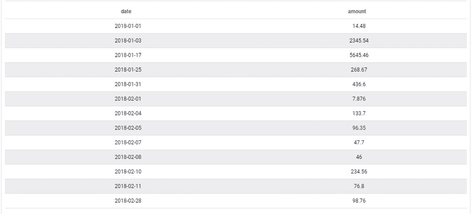
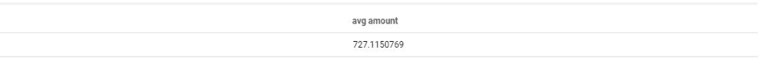
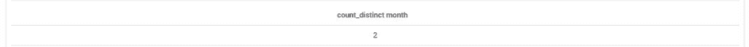
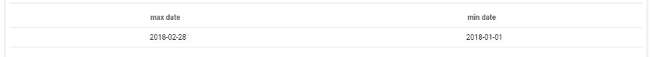
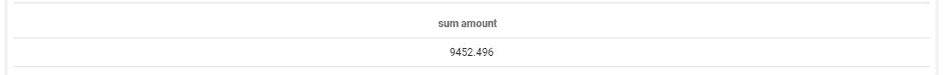

# 「data」クエリパラメータ

このパラメータは、目的のデータを選択して表示するのに使用します。各属性に対し、average、count、distinct count、max、min、select、distinct select、sumなどのシンプルな関数を適用できます。

---

## select

*select*関数は選択した属性の値を表示します。複数の値が返される場合は、最初の値が選択されます。最初に、date属性とamount属性を表示するとします。インターフェースで、右側のフィールドをクリックし、関数「*select*」を選択します。これに対応するJSONは、次のようになります。

```json
...
  "data": {
    "fields": {
      "date": [
        "select"
      ],
      "amount": [
        "select"
      ]
    }
  }
...

```

これは次のような結果になります。


同じテーブル内に存在するものであれば、必要な数だけフィールドを追加できます。フィールドが同じテーブル内に存在しない場合、Query Builder（QB）からエラーが返されます。インターフェースで指定可能なフィールドのリストは自動的にフィルタリングされ、利用可能な属性のみが表示されます。

> よりきめ細かな制御が必要な場合は、「table_name」属性を使用してデータの取得元のテーブルをハードコードすることができます。これは、数多くのテーブルで特定の属性名（「date」など）が共通している場合に役立ちます。ただし、Query Builderは実行時間を短縮するため最適なパスでデータを取得するようになっているため、この方法は良いやり方とは言えません。

---

## avg

*average*関数は属性の平均値を計算するのに使用します。この例では、一定期間の公表売上金額の平均値を返す場合を考えます。

```json
...
"data": {
    "fields": {
      "amount": [
        "avg"
      ]
    }
  },
...
```
これは次のような結果になります。


!> 各行を同じウェイトで「amount」属性の平均を計算しているため、テーブルがどのように細分化されているかによって、average演算の意味が変わる場合があることに注意してください。このため、弊社では、ウェイトを制御できるようにするため、仮想属性を介して平均や比率などを使用することをお勧めしています（オーダーあたりの平均、顧客あたりの平均、1日あたりの平均、1月あたりの平均など）。

---

## count

*count*関数はクエリで返す出現回数をカウントするのに使用します。この例では、テーブル内に存在する行数をカウントする場合を考えます。これに対応するJSONは、次のようになります。
```json
...
  "data": {
    "fields": {
      "date": [
        "count"
      ]
    }
  }
...
```

これは次のような結果になります。


---

## count distinct

*count distinct*関数は属性の固有の異なる値をカウントするのに使用します。この例では、テーブル内に存在する固有の月の数をカウントする場合を考えます。これに対応するJSONは、次のようになります。
```json
...
  "data": {
    "fields": {
      "month": [
        "count_distinct"
      ]
    }
  }
...
```
これは次のような結果になります。


---

## minおよびmax

*minおよびmax*関数は属性の最小値と最大値を表示するのに使用します。この例では、テーブル内の最小日付と最大日付を求める場合を考えます。これに対応するJSONは、次のようになります。

```json
...
  "data": {
    "fields": {
      "date": [
        "min",
        "max"
      ]
    }
  }
...
```
これは次のような結果になります。


---

## select distinct

*select_distinct*関数は属性の固有の異なる値を表示するのに使用します。この例では、月ごとのこの会社の公表売上金額を表示する場合を考えます。これに対応するJSONは、次のようになります。

```json
...
 "data": {
    "fields": {
      "month": [
        "select_distinct"
      ]
    }
  }
...
```
これは次のような結果になります。


!> 弊社では、*scale*パラメータ（SQLのGROUP BYに相当）を使用することをお勧めしています（別の記事で同様のクエリを実行しています）。

---


## sum

*sum*関数は属性の合計値を計算するのに使用します。この例では、合計売上を取得する場合を考えます。これに対応するJSONは、次のようになります。

```json
...
  "data": {
    "fields": {
      "amount": [
        "sum"
      ]
    }
  }
...
```
これは次のような結果になります。


---

{データセットのさまざまな次元について確認する}(#/jp/product/query-builder/queries/parameters/scale.md)