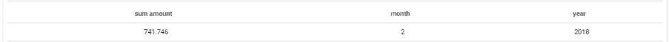

# 「filter」クエリパラメータ

このパラメータは、クエリで返す必要のある選択された値にフィルターを適用するのに使用します。フィルターは、Nullやラベルなしの値が表示または考慮されないようにする場合に特に便利です。

## フィルターオプションのリスト

以下に利用可能なすべてのフィルターオプションを示します。
* *in* - 参照リストに含まれる値
* *not_in* - 参照リストに含まれない値
* *between* - 値が2つの極値の間に存在する
* *not_between* - 値が2つの極値の間に存在しない
* *equal* - 値が参照と等しい
* *not_equal*  - 値が参照と等しくない
* *like*  - 値のサブ文字列が別の参照値に含まれる
* *not_like* - 値のサブ文字列が別の参照値に含まれない
* *is_null* - 値がNullである
* *is_not_null*  - 値がNullでない
* *gt* (>) - 値が参照よりも大きい
* *gte* (> =) - 値が参照値以上である
* *lt* (>)  - 値が参照値よりも小さい
* *lte* (<=) - 値が参照値以下である

## 簡単な例

次に、2018年1月のみの売上を表示する場合を考えます。

```json
 {
  "data": {
    "fields": {
      "amount": [
        "sum"
      ]
    }
  },
  "scale": {
    "fields": []
  },
  "filter": {
    "month": [
      1
    ],
    "year": [
      2018
    ]
  },
  "order": {}
}
```

> 数値でフィルターを適用する場合は、引用符を付けずにJSONを入力します。数値以外の値の場合は、値を引用符（""）で囲む必要があります。例えば、"filter": {"date": ["2018-01-01"]}のように指定します。

2月1日と2月28日の間の合計売上を表示する場合は、次のように、betweenフィルターを使用します。

```json
 {
  "data": {
    "fields": {
      "amount": [
        "sum"
      ],
      "month": [
        "select"
      ],
      "year": [
        "select"
      ]
    }
  },
  "scale": {
    "fields": []
  },
  "filter": {
    "date": {
      "between": [
        "2018-02-01",
        "2018-02-28"
      ]
    }
  },
  "order": {}
}
```


---

{その他のパラメータを確認する}(#/jp/product/query-builder/queries/parameters/others.md)