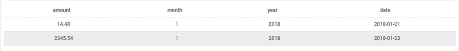
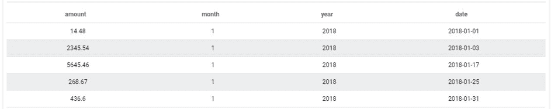
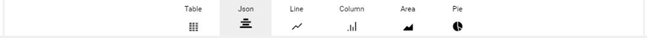

# その他のクエリパラメータ

この記事では、ForePaaSでクエリを作成するのに使用する比較的使用頻度の低い残りのパラメータについて説明します。具体的には、以下の内容について説明します。
* *limit* - クエリの出力数を制限する機能
* *order* - 他の属性に基づいてクエリの出力の順序付けを行う機能
* *table_name* - データの取得元のテーブルを設定する機能
* *skip* - 一定数のクエリの最初の出力をスキップする機能
* *hints* - 生のJSONクエリレスポンスで表示するメタデータを増やす機能
* *total& - 複数のスケールを使って合計を計算する場合に小計を計算する機能

---

## limit

一度に大量の情報を表示すると、すべてのメモリが使用されてブラウザがフリーズすることがあります。そのため、クエリで返される行数を制限しなければならない場合がよくあります。これを行うには、*limit*サブパラメータを目的の数値に設定します。

デフォルトで、クエリを利用するWebページが過負荷になるのを防ぐため、limitは5000に設定されています。これは最大値ではなく、「limit」パラメータを別の値に設定して値を大きくすることもできます。

1月の行を2行だけ表示する場合を考えます。これに対応するJSONは、次のようになります。
```json
 {
  "data": {
    "fields": {
      "date": [
        "select"
      ],
      "amount": [
        "select"
      ]
    },
    "limit" : 2
  },
  "scale": {
    "fields": []
  },
  "filter": {
    "month": [
      1
    ],
    "year": [
      2018
    ]
  },
  "order": {}
}
```
これは次のような結果になります。


---

## order

このクエリで返される結果は、1つ以上のフィールドの値の順序に基づいて昇順または降順に順序付けされます。これを行うには、フィールドのリストと出力を順序付けする方向を指定して*order*パラメータをJSONの設定に追加する必要があります。

1月のデータを昇順に順序付けする場合を考えます。これに対応するJSONは、次のようになります。

```json
 {
  "data": {
    "fields": {
      "amount": [
        "select"
      ],
      "date": [
        "select"
      ] ,
      "month": [
        "select"
      ] ,
      "year": [
        "select"
      ] 
    }
  },
  "scale": {
    "fields": []
  },
  "filter": {
    "month": [
        1
      ],
    "year": [
        2018
      ]
   },
  "order": {
      "date" : "asc"
  }
}
```

これは次のような結果になります。


---

## table_name

*data*パラメータの記事で触れたように、*table_name*パラメータを設定することで、Query Builderでデータモデル内の特定のテーブルからデータが強制的に取得されます。

例えば、Query Builderで要求されたデータが「prim_revenue」テーブルから取得されるようにするには、次のJSONの設定を使用します。

```json
 {
  "data": {
    "fields": {
      "amount": [
        "sum"
      ],
      "month": [
        "select"
      ],
      "year": [
        "select"
      ]
    }
  },
  "scale": {
    "fields": [
      "month"
    ,
      "year"
    ]
  },
  "filter": {},
  "order": {},
  "table_name":"prim_ca"
}
```
---

## skip

*skip*サブパラメータを使用すると、最終的に出力される行の一部の行をスキップできます。 

例えば、出力が一定の順序に配置されている場合に、最初の5個または10個の出力を削除する必要があるとします。この例では、JSONの設定は次のようになります。

```json
 {
  "data": {
    "fields": {
      "date": [
        "select"
      ],
      "amount": [
        "select"
      ]
    },
    "skip": 10
  },
  "scale": {
    "fields": []
  },
  "filter": {},
  "order": {}
}
```

---

## hints

*hints*サブパラメータを使用すると、*skip*および*limit*パラメータを考慮せずに生成される合計行数を示すメタデータをQuery BuilderのJSONレスポンスに追加できます。*hints*パラメータはJSONの設定に次のように追加できます。

```json
  {
  "data": {
    "fields": {
      "date": [
        "select"
      ],
      "amount": [
        "select"
      ]
    },
    "limit": 2,
    "skip": 5,
    "hints": true
  },
  "scale": {
    "fields": []
  },
  "filter": {},
  "order": {}
}
```
クエリの出力への影響を確認するには、生のJSONを直接ビジュアル表示する必要があります。このためには、クエリの編集画面の出力表示ウィンドウで「Json」オプションを選択します。


以下の結果が表示されます（JSONオブジェクトのテーブルとして出力される*results*キーの実際のクエリ出力を縮小表示にしています）。
```json
  {
  "success": true,
  "cache": false,
  "timestamp": 1559896936,
  "duration": 0.11,
  "error": null,
  "warning": null,
  "hints": 13,
  "query_params": {
    "data": {
      "fields": {
        "date": [
          "select"
        ],
        "amount": [
          "select"
        ]
      },
      "limit": 2,
      "skip": 5,
      "hints": true
    },
    "scale": {
      "fields": []
    },
    "filter": {},
    "order": {}
  },
  "table_name": "prim_income",
  "results": [...]
 }
```

---

## total

「my_scale1」および「my_scale2」という2つのスケールに対して「mydata」というメジャーの合計を計算する場合を考えます。このクエリは次のようになります。
```
...
  "data": {
     "fields": {
       "mydata": ["SUM"]
    }
  },
  "scale": {
    "fields": ["my_scale1","mys_cale2"]
  }
...
```
このクエリでは、次のSQLクエリと同じものが生成されます。

```
SELECT SUM(mydata) FROM .... GROUP BY my_scale1, my_scale2
```

この出力データを使用して、次のような表を簡単に作成できます。

|  | my_scale1 1 | my_scale1 2 |
| ---| --- | --- | 
| my_scale2 1 | sum 1x1 | sum 1x2 |
| my_scale2 2 | sum 2x1 | sum 2x2 |

クエリにtotal属性を追加します。
```
...
  "data": {  },
  "scale": {  },
  "total": {
     "all": [],
     "x": [myscale1],
     "y": [myscale2]
  }
...
```
次のような表示になります。

| X | my_scale1 1 | my_scale1 2 | total |
| ---| --- | --- | --- |
| my_scale2 1 | sum 1x1 | sum 1x2 | total.x |
| my_scale2 2 | sum 2x1 | sum 2x2 | total.x |
| total | total.y | total.y | total |

この場合は、次の4つの異なるSQLクエリが必要になります。
```
SELECT SUM(mydata) FROM ... GROUP BY my_scale1, my_scale2
SELECT SUM(mydata) FROM ...
SELECT SUM(mydata) FROM .... GROUP BY my_scale1
SELECT SUM(mydata) FROM .... GROUP BY my_scale2
```

---

この記事では、カスタマイズ可能な複雑なクエリを作成するのに利用できるすべてのパラメータについて詳しく説明しました。ご要望やご質問がある場合は、遠慮なくご連絡ください。

{サポートに質問を送付する🤔}(https://support.forepaas.com/hc/en-us/requests)

