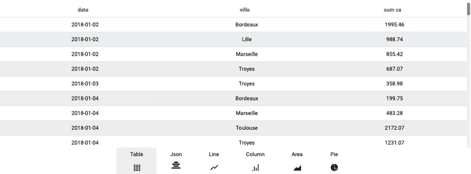
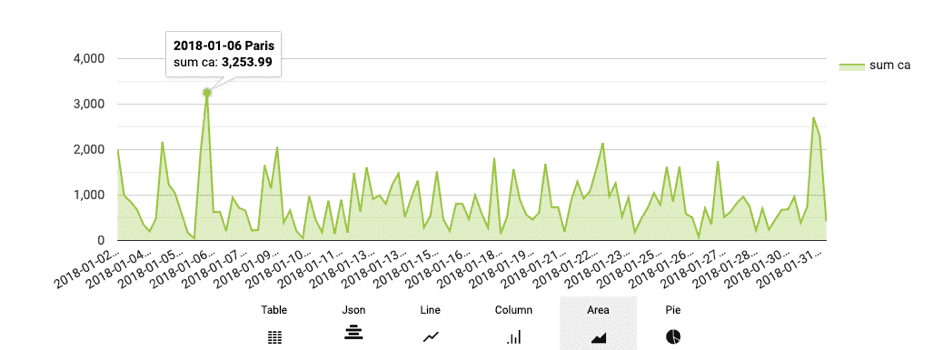
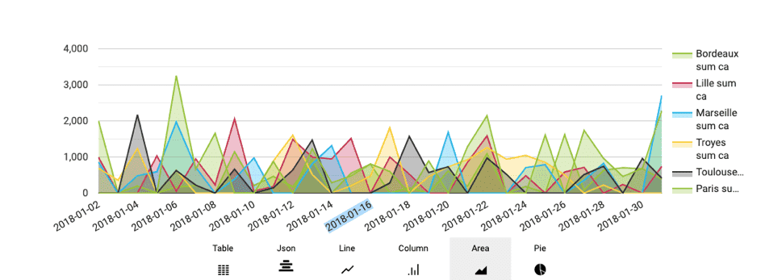

# 「scale」クエリパラメータ

多くの**クエリパラメータはサブパラメータを使用して微調整**することができます。この記事では、*scale*パラメータの主な用途を確認し、*axis*サブパラメータを使用した「スケール」の活用方法について説明します。

---

## 「scale」パラメータの使用

このパラメータは、ある属性（「メジャー」）の値を別の属性（「ディメンション」）に従って再グループ化するのに使用します。 

例えば、月ごとの売上金額や店舗ごとの売上金額を表示します。スケールパラメータに属性を追加することで、可能な限り多くのスケールを追加することができます。 

ここでは、月ごとの合計売上を計算する場合を考えます。これに対応するJSONは、次のようになります。

```json
 {
  "data": {
    "fields": {
      "amount": [
        "sum"
      ]
    }
  },
  "scale": {
    "fields": [
      "month"
    ]
  },
  "filter": {},
  "order": {}
}
```
> このクエリでは、スケールとして使用する属性の一意の値の組み合わせごとに1つの行が表示されます。このため、クエリの出力値の負荷が急速に大きくなる可能性があります。5つのスケールを使用し、それぞれに5つの異なる値が存在する場合、組み合わせの数は3125になります。

---

## 「axis」サブパラメータの使用 

異なる複数のディメンションでクエリを分割すると、一部のグラフィックが望ましい表示にならない場合があります。

次のクエリの場合について考えます。

```json
 {
  "data": {
    "fields": {
      "ca": [
        "sum"
      ]
    }
  },
  "scale": {
    "fields": [
      "date",
      "city"
    ]
  }
}
```

Query Builderの「Editor（エディター）」画面では、次のように異なる表示になります。


「Table（表）」の表示は問題ありませんが、「Area（面グラフ）」は次のようになります。

 
このグラフのデフォルトモードでは、「都市と日付」の組み合わせごとに1つのグラフが作成されます。ForePaaSで提供されている多くのデフォルトのグラフでは、「axis」を使用して切り出した形で表示することができるため、このグラフも異なる表示に切り出すことができます。

クエリを再度実行し、次のようにフィールド「scale.axis」を追加します。

```json
 {
  "data": {
    "fields": {
      "ca": [
        "sum"
      ]
    }
  },
  "scale": {
    "fields": [
      "date",
      "city"
    ],
    "axis":{
        "x":["date"],
        "y":["city"]
    }
  }
}
```

axisの「x」軸は常にデフォルトフィールドに対応します。
「y」軸は使用するグラフの種類やライブラリによって異なりますが、ほとんどの場合、データが別々の系列に切り分けられます。

この場合、表示は次のようになります。 


---

{クエリにフィルターを適用する}(#/jp/product/query-builder/queries/parameters/filter.md)