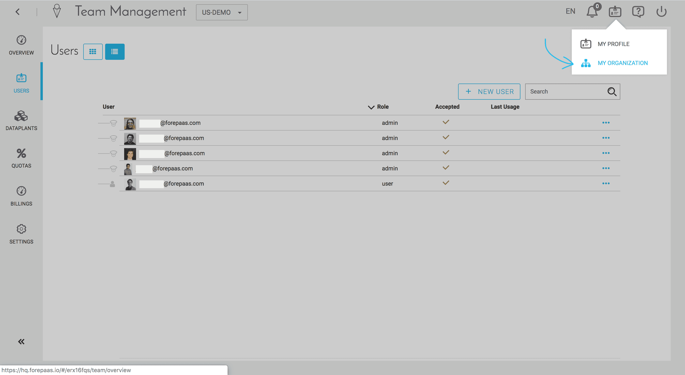
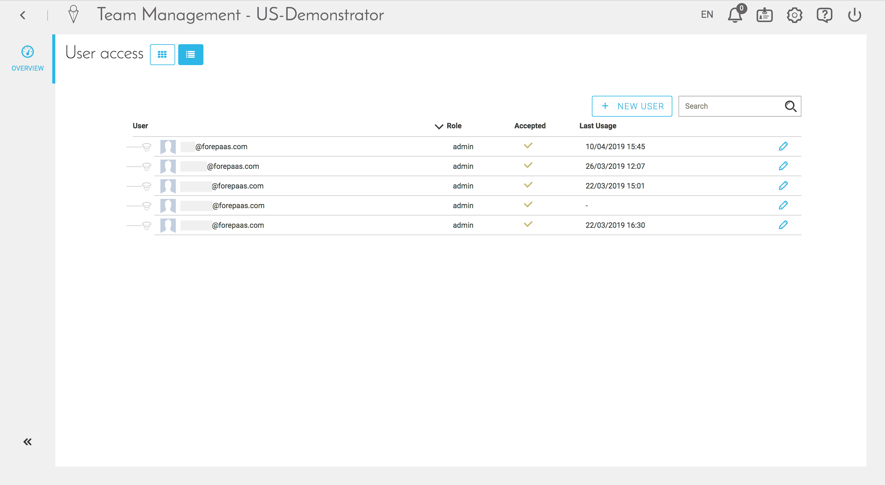

# Team Management

The ForePaaS platform facilitates collaboration across your team and allows you to create Organizations for this purpose. An Organization lets teams work on one or more Dataplants simultaneously. All access rights for an Organization are managed through the "Team Management" capabilities of ForePaaS.

The following rules apply to Organizations:
* One DataPlant belongs to only one organization
* One Organization can host multiple DataPlants
* One user can belong to several Organizations
* There are 2 user status: "Admin" or "User"

!> There are 2 levels of Team Management on ForePaaS: at the **Organization** level and regarding the **DataPlant**

## Team Management at the Organization level
You can manage your Organization users by going to the header toolbar and selecting the "Settings" icon located on the top right of your screen. Choose "My Organization" and navigate to the "Users" tab.

If you are an admin of the Organization you will be able to:
* Manage your team inside the Organization
* Add a new user to your Organization

{Configure your user rights in an Organization}(#/jp/product/team-management/user-rights)

## Team Management at the DataPlant level

The Team Management component allows you to manage your ForePaaS users for a given DataPlant from a simple interface. From this module, you can:
- Add a new user
- Manage the roles of your users: Admin / User
- View active users and their last connections

