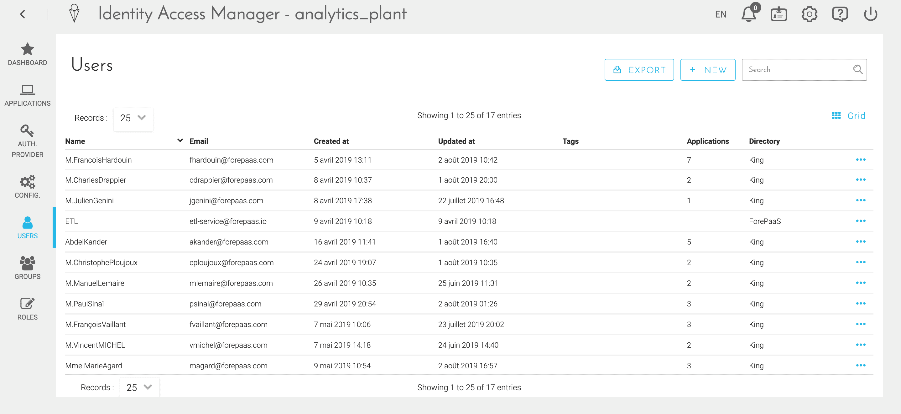
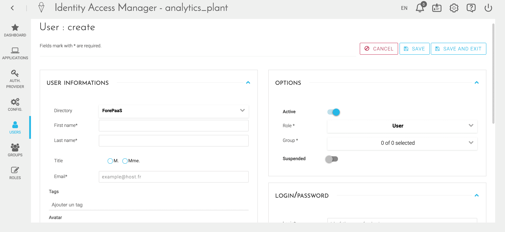
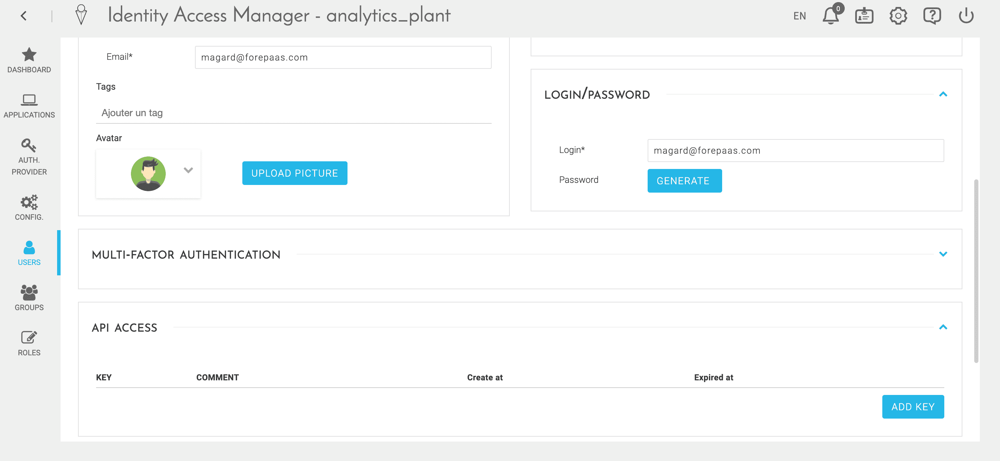
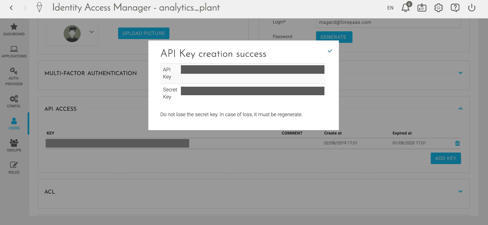
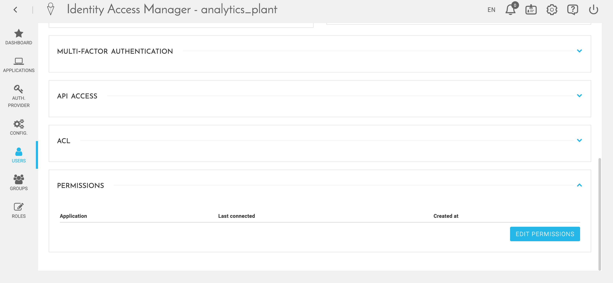
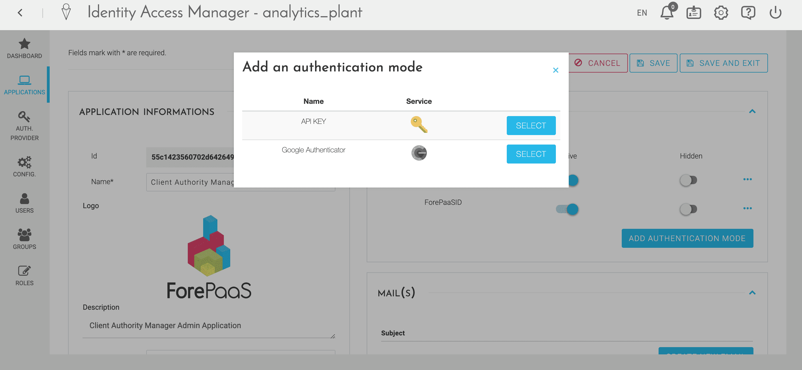

# Configure a REST Web Service

!> Uh-oh! It seems this page contains outdated information. Please reach out to our support team if you need help with anything. 


In this tutorial, you will learn how to configure a Web Service to perform QB queries from an external appliance / service.  
The return formats may be JSON, CSV or XLSX.


**Requirements**: have an application in the application module (even if it is not built or deployed)

---
## Get credentials

1. Click on **Identity Access Manager** and go to **Users** menu.  

1. Add a user and click on "Save".  

1. Add an API key to the user you've just created by clicking on **Add Key**.  

1. Save the API Key and Secret Key that you got  

1. Give access to the application used for the Web Service in the **Permissions** section and click on **Save & Exit**  

1. Go to the **Application** menu
  1. Take note of the *Application ID**
  1. Add the API mode to the authentication permissions of your application.  
Then click on **Save and Exit**.  


---
## Authentication using API Key and Secret Key

The recovery of the token is carried out via a POST request. The token has a default lifetime of one hour (this delay can be configured in the "Config" menu of the Identity Access Manager)

```sh
curl -X POST \
  https://my-dataplant.forepaas.io/cam/login \
  -H 'Content-Type: application/json' \
  -d '{
    "apikey":"Votre API Key",
    "secretkey":" Votre Secret Key ",
    "app_id":" Votre APP ID ",
    "auth_mode":"apikey"
}'
```

---
## Run queries via the Web Service

### JSON Output

```
curl -X POST \
  https://my-dataplant.forepaas.io/myapi-api/qb/query?app_id=your_app_id&token=your_token \
  -H 'Content-Type: application/json' \
  -d '{
    "data": {
      "fields": {
        "date": ["min", "max"]
      }
    }
}'
```

### CSV Output
```sh
curl -X POST \
  https://my-dataplant.forepaas.io/myapi-api/qb/query.csv?app_id=your_app_id&token=your_token \
  -H 'Content-Type: application/json' \
  -d '{
    "data": {
      "fields": {
        "date": ["min", "max"]
      }
    }
}'
```

> **Note** CSV formatting may be controlled with `options` in the query, as for instance :
```json
"options":{
  "collapse": "false", 
  "scales": {
    "x": [
     {"field": "field_name_1", "type":"scale"},
     /*...*/
     {"field": "field_name_n", "type":"scale"}
    ],
    "y": [{"type": "data"}]
  }
}
```

### XLSX format 
```sh
curl -X POST \
  https://my-dataplant.forepaas.io/myapi-api/qb/query.xlsx?app_id=your_app_id&token=your_token \
  -H 'Content-Type: application/json' \
  -d '{
    "data": {
      "fields": {
        "date": ["min", "max"]
      }
    }
}'
```

!> **Note:** using `options` it is possible to better control the output. 

