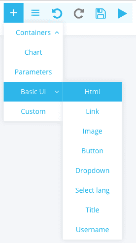
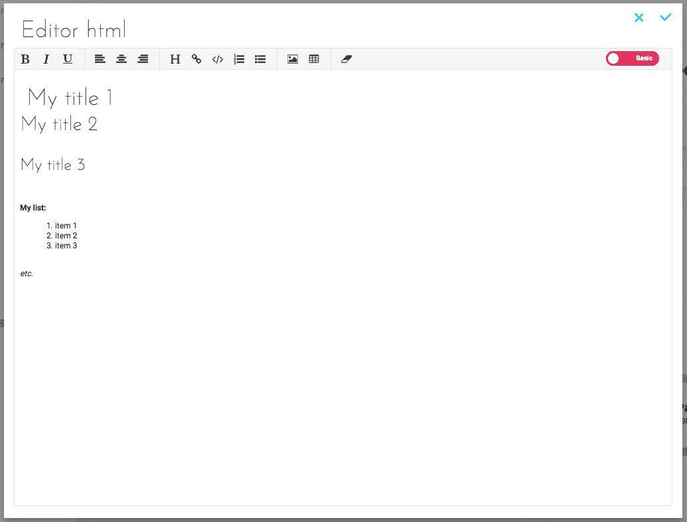
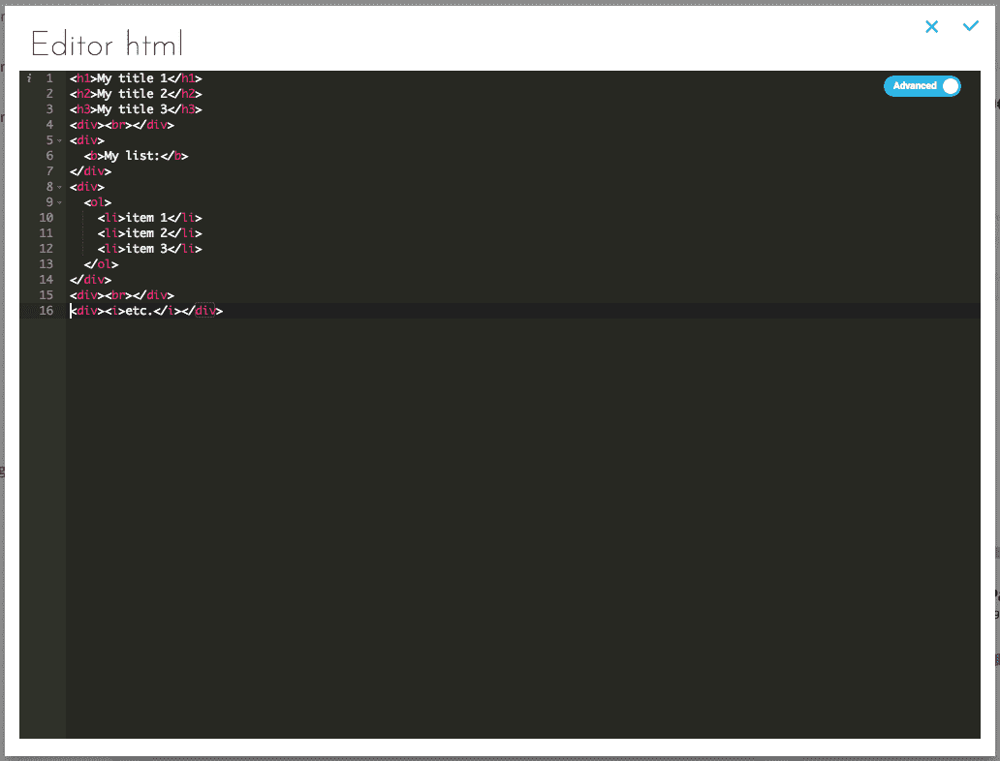
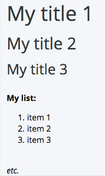

# HTML

Allows you to create any element in HTML (paragraph, title, image, etc.).

## Add HTML
Select Basic UI -> Html.

## Configure HTML
### Simple configuration

This configuration allows you to configure the HTML in a simple and intuitive way.

### Advanced configuration

This configuration allows you to configure the HTML via a JSON document. Below is the JSON corresponding to the Switch created with the simplified configuration:

## Result

