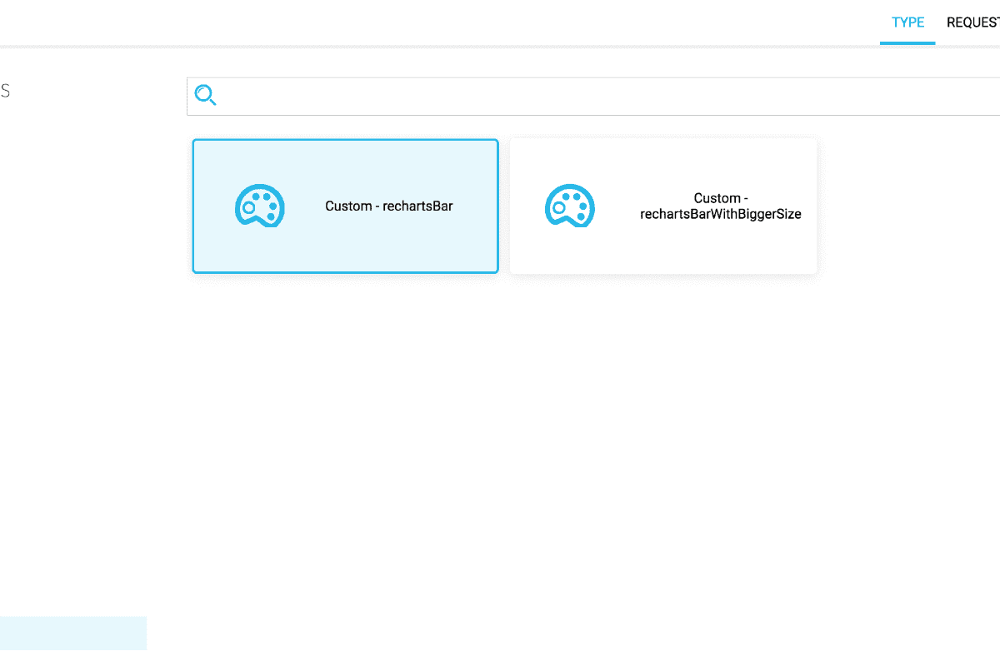
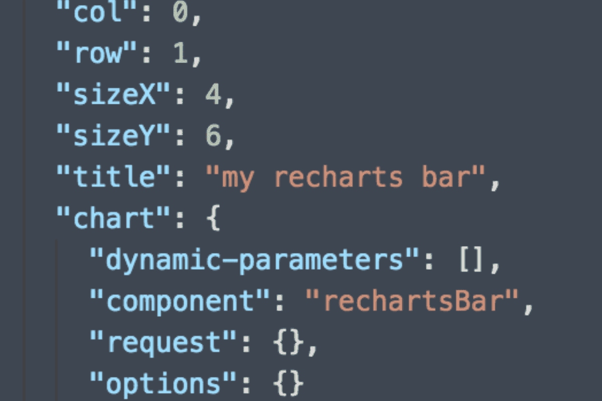
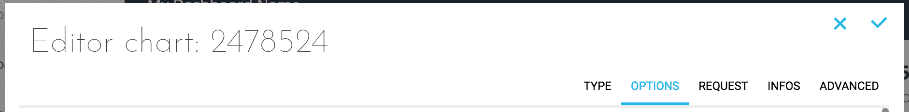
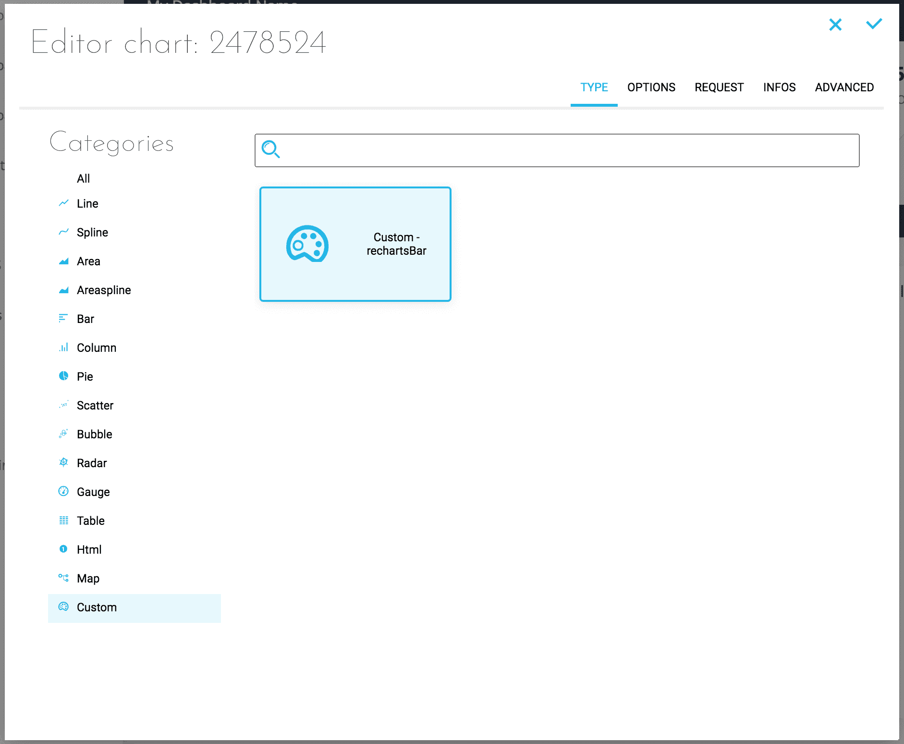
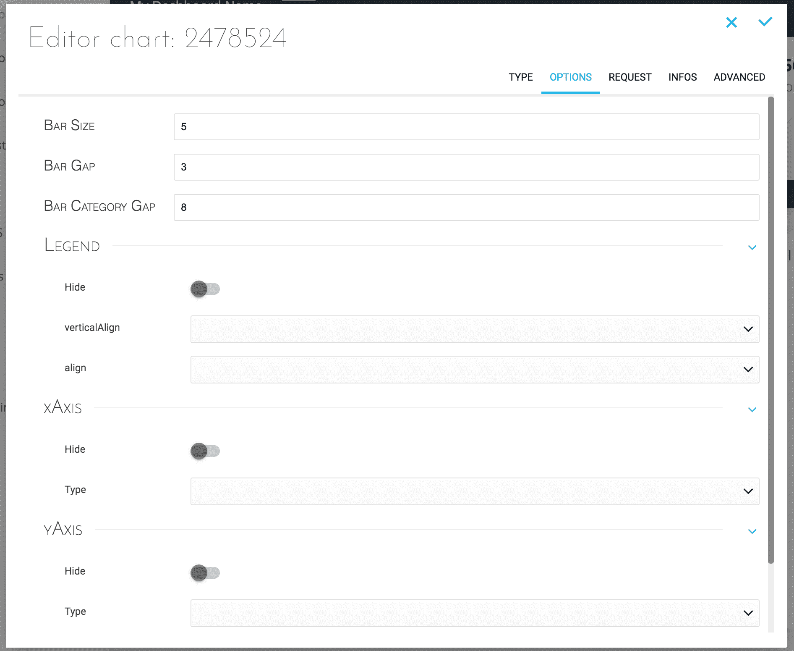

# Chart templates


Style templates can be applied to your favorite chart libraries **to automatically setup the configuration for every chart you want to look the same**. You can use style templates in a simple way, either from *Architect* (ForePaaS' dashboard creation tools) or locally on your machine.

---

## Why use style templates?

Here is a chart configuration structure. Please [see this documentation page for more details on charts](/jp/technical/sdk/app/custom-chart).

```json
{
    "type": "chart",
    "col": 0,
    "row": 1,
    "sizeX": 12,
    "sizeY": 12,
    "title": "",
    "chart": {
        "component": "my-component",
        "options": {},
        "request": {}
    }
}
```

You can pass props to your charts using the `options` object.  
For example, if you want to define a bar chart with Recharts, with a `barGap` of 3, a` barSize` of 6 and a specific margin, you can pass the following options:

```json
"options": {
    "barGap": 3,
    "barSize": 6,
    "margin": {
         "left": 20,
         "right": 20,
          "top": 40,
          "bottom": 35
     }
}
```

Things can get complicated if you want all your bar charts to have the same configuration controllable outside of the individual chart widgets, without having to repeat the setup for every chart.

ForePaaS offers a simple solution to do that: **create style templates for your configurations**.

---

## Step 1: Create Templates

Everything will happen in the `config/templates.json` file. This is where you define all your templates.

A template is defined like this:

```json
"templateName": {
    "component": "", // Name of the component where the options will be applied
    "options": {
        ...yourOptions
    }
}
```

To use the example above, this would translate as follows:

```json
"rechartsBar": {
    "component": "recharts.bar",
    "options": {
        "barGap": 3,
        "barSize": 6,
        "margin": {
             "left": 20,
             "right": 20,
             "top": 40,
             "bottom": 35
        }
    }
}
```

### Defining the template name

The `templateName` can be used in 2 ways:

#### 1. *Using the name of an existing component* 

The options will apply to all components of this type.
In this case, the `component` property is omitted, otherwise the options will not be applied. This works for either a component created by ForePaas or a spec component [(see documentation)](/jp/technical/sdk/app/custom-chart).

**Example**: these options will be applied by default as soon as you use a `recharts.bar` chart

```json
"recharts.bar": {
    "options": {
        "barGap": 3,
        "barSize": 6,
        "margin": {
            "left": 20,
            "right": 20,
            "top": 40,
            "bottom": 35
        }
    }
}
```

#### 2. *Defining a template name*

The options will apply as soon as you use this template in the definition of your chart (more details in *Step 2: Using templates*).

> Component names are especially used when you want to define a theme for your application, while template names will be used in more specific cases (for example to make a modification to the theme on a particular chart).


### Creating a second template based on a first template

ForePaaS provides a simple way to create templates that not only leverage most of the options from an initial one and but also receive modifications done to the latter automatically.  


Simply add the `extends` element to your template:

```json
"rechartsBarWithBiggerSize": {
    "extends": "rechartsBar",
    "options": {
        "barSize": 10,
        "barCategoryGap": 5
    }
}
```

?>[🌠 Learn more about the extends element here!](jp/technical/sdk/app/charts/template-extends)


---

## Step 2: Using Templates

To use your templates, you have 2 possibilities:
- Architect (via the platform)
- Locally (via config .json files)

### Via Architect

You will find the templates you previously created while selecting the type of chart in the category 'Custom'.



You just have to select it from the chart, indicate the request and validate it at the top right.


### Locally

Whether locally or via the platform editor, **you just need to enter the name of your template** as the value of the `component` of your chart:



If you wish to modify one of the options, you can modify them in the `option` object. These will add and / or replace the options defined in the template (exactly as the ``extend`` seen above).


## Bonus: Addition of configurable options via Architect

These options are those that you can configure from *Architect*, the chart creation or editing interface.



When you define your charts and options via your code, it is easy to rewrite an option of a template (such as a color for example) by indicating it in the options of the chart. 

But it's not that easy if you (or your users) are using *Architect*. Indeed, your new templates are now available from this UI but apart from the charts defined by ForePaaS and their pre-configured options, you cannot modify or rewrite the options defined in your template without going through the json configuration in the advanced mode (which is not the most intuitive for your users).

There are ways to add options in this interface in order to simplify creating or editing a chart for your users.

To sum it up, using a config in .json you will be able to manage a form accessible via the chart creation/edition UI which will add the relative keys & values in the `options` object of your chart.

The type of the option (object, text, number, table, ...) is defined first, then the type of the input.

**Example**:

```json
{
    "xAxis": {
        "label": "xAxis",
        "type": "object",
        "options": {
            "hide": {
                "type": "toggle",
                "label": "Hide"
            },
            "type": {
                "label": "Type",
                "type": "select-box",
                "options": [
                    {
                        "label": "number",
                        "value": "number"
                    },
                    {
                        "label": "category",
                        "value": "category"
                    }
                ]
            }
        }
    }
}
```

Will generate the following object (because the type is `object`) in the `options`:

```json
"xAxis": {
    "hide": true / false, // Toggle will give a boolean
    "type": "number" / category // according to the value selected in the select-box
}
```

By adding this configuration in the `optionsArchitect` property, you will find these options in the `options` tab from your chart configuration.

Here is an example configuration:

```json
{
    "rechartsBar": {
        "options": {
            "barGap": 3,
            "barSize": 6,
            "margin": {
                 "left": 20,
                 "right": 20,
                 "top": 40,
                 "bottom": 35
            }
        },
        "component": "recharts.bar"
    },
    "optionsArchitect": {
        "barSize": {
            "type": "number",
            "label": "Bar Size"
        },
        "barGap": {
            "label": "Bar Gap",
            "type": "number"
        },
        "barCategoryGap": {
            "label": "Bar Category Gap",
            "type": "number"
        }
    }
}
```

Which gives the following result:





> **Tip:** Do not hesitate to have a look at how the options of the libraries already defined by ForePaaS are defined: see file `forepaas.json` -> key`options` for more examples.

---

## Still need help? 🆘

You didn't find the answer you were looking for in this page? 🙁  
Please feel free to [reach out to a support expert](https://support.forepaas.com), we're always happy to help!