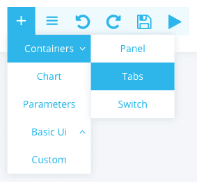
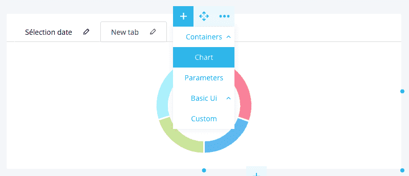
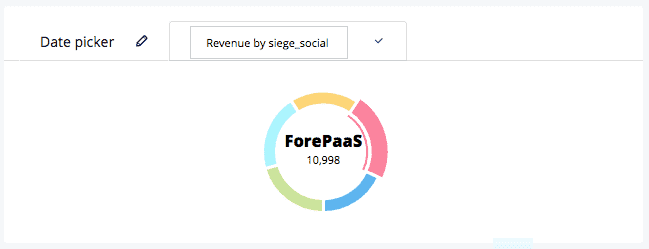
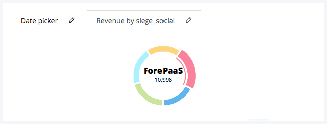

# Tabs

Tabs represent panels grouped together. Each tab contains a single element (graphic, dynamic parameters, etc.).

## Add Tabs
Select Container > Tabs.

## Add elements
Then add the items by clicking on the +. 

## Edit names of tabs
You can edit the tab name at any time by clicking on the small pencil on the right side of the tab.

## Result

